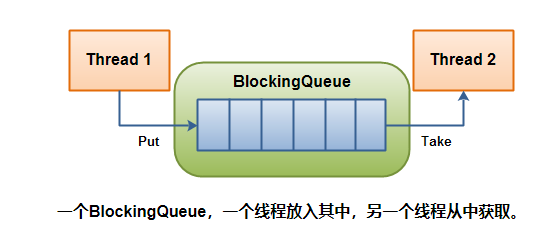
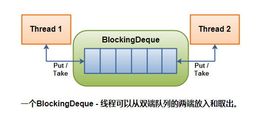

# Java Concurrency组件（siwang.hu&nbsp;&nbsp;V1.0）  
> Java java.util.concurrent包是Java 5引入的，包含一组类，可以更容易地用Java开发并发（多线程）应用程序  
## BlockingQueue接口  
> A BlockingQueue通常用于在线程上生成另一个线程消耗的对象: 
>   
>   
>  
> 生成线程将生成新对象并将它们插入队列，直到队列达到它可以包含的内容的某个上限。换句话说，这是限制。如果阻塞队列达到其上限，则在尝试插入新对象时会阻止生成线程。它一直被阻塞，直到消费线程将一个对象从队列中取出。消费线程不断将对象从阻塞队列中取出并处理它们。如果消费线程尝试将对象从空队列中取出，则消耗线程将被阻塞，直到生成线程将对象放入队列。  
>  
> *无法插入null到BlockingQueue。如果您尝试插入null， BlockingQueue则会抛出一个NullPointerException*  
>  **由于BlockingQueue是一个接口，您需要使用其中一个实现来使用它：**  
> + ArrayBlockingQueue  
> + DelayQueue  
> + PriorityBlockingQueue  
> + SynchronousQueue
## ArrayBlockingQueue  
> + ArrayBlockingQueue类实现了BlockingQueue接口
>  
> + ArrayBlockingQueue是一个有界的阻塞队列，它将元素内部存储在一个数组中。它有界意味着它无法存储无限量的元素。它可以同时存储的元素数量有一个上限。您在实例化时设置上限，之后无法更改。  
>  
## DelayQueue  
> + DelayQueue实现BlockingQueue接口  
>  
> + DelayQueue队列中每个元素都有个过期时间，并且队列是个优先级队列，当从队列获取元素时候，只有过期元素才会出队列。
>  
> + 在DelayQueue内部阻止元素直到某个延迟到期。元素必须实现接口java.util.concurrent.Delayed。以下是界面的外观：  
```
public interface Delayed extends Comparable<Delayed< {
    public long getDelay(TimeUnit timeUnit);
}
```
> getDelay()方法 返回的值应该是在释放此元素之前剩余的延迟  
>  
> **Demo:**  
```
public class DelayQueueExample {

    public static void main(String[] args) {
        DelayQueue queue = new DelayQueue();

        Delayed element1 = new DelayedElement();

        queue.put(element1);

        Delayed element2 = queue.take();
    }
}
```
## LinkedBlockingQueue  
> + LinkedBlockingQueue类实现了BlockingQueue接口  
```
BlockingQueue<String> unbounded = new LinkedBlockingQueue<String>();
BlockingQueue<String> bounded   = new LinkedBlockingQueue<String>(1024);
bounded.put("Value");
String value = bounded.take();
```
## PriorityBlockingQueue  
> + PriorityBlockingQueue  
> + PriorityBlockingQueue存储的对象必须是实现Comparable接口的 因为PriorityBlockingQueue队列会根据内部存储的每一个元素的compareTo方法比较每个元素的大小,这样在take出来的时候会根据优先级 将优先级最小的最先取出。  
```
    public static PriorityBlockingQueue<User> queue = new PriorityBlockingQueue<User>();
 
    public static void main(String[] args) {
        queue.add(new User(1,"wu"));
        queue.add(new User(5,"wu5"));
        queue.add(new User(23,"wu23"));
        queue.add(new User(55,"wu55"));
        queue.add(new User(9,"wu9"));
        queue.add(new User(3,"wu3"));
        for (User user : queue) {
            try {
                System.out.println(queue.take().name);
            } catch (InterruptedException e) {
                e.printStackTrace();
            }
        }
    }
 
    static class User implements Comparable<User>{
 
        public User(int age,String name) {
            this.age = age;
            this.name = name;
        }
 
        int age;
        String name;
 
        @Override
        public int compareTo(User o) {
            return this.age > o.age ? -1 : 1;
        }
    }
```
## SynchronousQueue  
> + SynchronousQueue实现BlockingQueue接口
> + SynchronousQueue是一个内部只能包含单个元素的队列。将元素插入队列的线程被阻塞，直到另一个线程从队列中获取该元素。同样，如果线程尝试获取元素并且当前不存在任何元素，则该线程将被阻塞，直到线程将元素插入队列。
## BlockingDeque接口  
> + 双端队列  
>  
>   
>  
> + 线程将生成元素并将它们插入队列的任一端。如果双端队列当前已满，则插入线程将被阻塞，直到删除线程将一个元素从双端队列中取出。如果deque当前为空，则将阻止删除线程，直到插入线程将元素插入到双端队列中。  
>  
> + LinkedBlockingDeque类是BlockingDeque接口的具体实现  
## ConcurrentMap  
```
ConcurrentMap concurrentMap = new ConcurrentHashMap（）;

concurrentMap.put（“key”，“value”）;

Object value = concurrentMap.get（“key”）;
```
> + java.util.concurrent.ConcurrentMap接口表示一个 能够处理并发访问（put和gets）的Map  