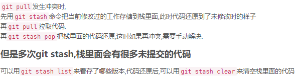

# Git笔记（siwang.hu&nbsp;&nbsp;V1.0）  
> + git -- 分布式版本控制工具  
## 安装git  
> + Linux上可以直接执行**sudo apt-get install git**  
> + windows上下载安装&nbsp;&nbsp;[git地址](https://git-scm.com/downloads)  
## 配置git  
> + git是分布式版本控制系统，每个机器都必须规定标识：你的名字和Email地址  
>  
> + **git config --global user.name "Your Name"**  
>  
> + **git config --global user.email "email@example.com"**  
>  
> + **ssh-keygen -t rsa -C "youremail@example.com"** 配置github公钥  
>  
> + 在~/下生成.ssh文件夹，打开id_rsa.pub，复制里面的key。到github 上，进入 Account => Settings，配置公钥  
## 基本使用  
> **git clone 仓库地址**&nbsp;&nbsp;&nbsp;&nbsp;克隆一个远程git仓库到本地  
>  
> **git pull**&nbsp;&nbsp;&nbsp;&nbsp;拉取远程仓库最新的代码
>  
> **git add -A** &nbsp;&nbsp;&nbsp;&nbsp;将所有文件的改动添加到提交仓库中  
>  
> **git add filename** &nbsp;&nbsp;&nbsp;&nbsp;将指定文件名的文件改动添加到提交仓库中  
>  
> **git commit -m "message"** &nbsp;&nbsp;&nbsp;&nbsp;提交所有改动，message为改动的附加信息  
>  
> **git push** &nbsp;&nbsp;&nbsp;&nbsp;将本地的提交推送到远程仓库  
>  
## 版本控制  
> **git log** &nbsp;&nbsp;&nbsp;&nbsp;查看当前分支commit提交的版本  
>  
> **git reset --hard e377f60e28c8b84158** 将版本回滚到指定版本(e377f60e28c8b84158时git log打印的每个版本对应的版本号)  
>  
> **git push -f** 强制对当前分支版本的回滚推送到远程仓库(非常危险的操作，会覆盖远程仓库的分支的以前修改，谨慎使用)  
>  
> + 如果远程主机的版本比本地版本更新，推送时Git会报错，要求先在本地做git pull合并差异，然后再推送到远程主机  
>  
> + **git push -f**可以强制推送，但会覆盖远程已经修改的代码，这个命令与团队中人员确定沟通，除非必要，否则不可轻易使用  
>  
> + 使用git pull拉取远程代码发生冲突时，需要自己手动解决冲突，可以先将自己的冲突文件重命令，然后git pull拉取远程代码，将自己的修改手动合并到新代码中，删除重命名的文件  
>  
>   
## 分支操作  
> **git branch** &nbsp;&nbsp;&nbsp;&nbsp;查看分支（可以列举本地所有的分支，以及标注出自己当前所属的分支）    
>  
> **git branch -a** &nbsp;&nbsp;&nbsp;&nbsp;查看远程仓库所拥有的分支
>  
> **git branch testname** &nbsp;&nbsp;&nbsp;&nbsp;创建一个新分支testname  
>  
> **git checkout testname**&nbsp;&nbsp;&nbsp;&nbsp;分支切换，将本地切换到testname分支  
>  
> **git branch -d testname**  删除分支testname  
>  
> **git push --set-upstream origin testname** 当你在本地仓库建立分支，远程并没有对应的分支时，需要采用这个命令第一次推送文件  
>  
> **git merge testname** 合并分支testname  
## 标签操作  
> + git对每个分支的的每次commit提交都会有一个唯一的Id表示，例如：e377f60e28c8b84158这种样子  
>  
> + 这种Id不容易记忆,可以对每次提交打一个标签来命名，例如：V1.0
>  
> + 默认标签是打在当前分支最新提交的commit上  
>  
> **git tag** &nbsp;&nbsp;&nbsp;&nbsp;查看所有标签  
>  
> **git tag v1.0** &nbsp;&nbsp;&nbsp;&nbsp;在最新commit提交上打上v1.0的标签

