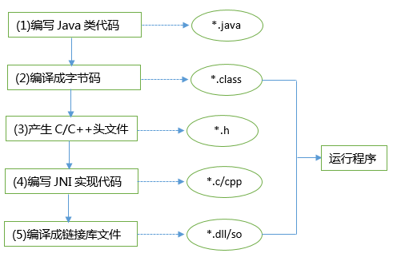
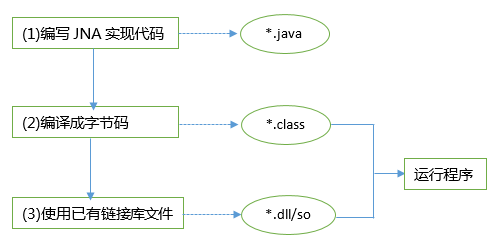
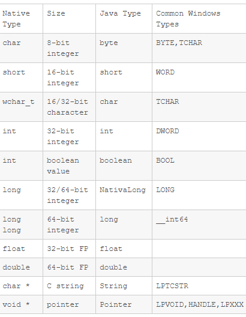

# Java JNA笔记（siwang.hu&nbsp;&nbsp;V1.0）  
> + JNA（Java Native Access）开源的Java框架，是一个调用本地动态库中方法的技术，建立在经典的JNI（Java Native Interface）基础上的一个框架  
>  
> + JNA技术比使用JNI技术调用动态链接库会有些性能损失,但总体影响不大  
>  
## JNI  
>   
>  
> **代码编写步骤**  
> + 创建本地Java的调用代码  
```
public class TestJNI {
    //声明Native方法
    public native int add(int a, int b); 

     public static void main(String[] args) {
         //待完善部分
     }
}
```
>  
> + 用javac编译生成字节码，**javac TestJNI.java**  
>  
> + 用javah生成中介（代理）动态库的头文件，**javah TestJNI**，运行后，生成TestJNI.h文件  
```
/* DO NOT EDIT THIS FILE - it is machine generated */
#include <jni.h>
/* Header for class TestJNI */

#ifndef _Included_TestJNI
#define _Included_TestJNI
#ifdef __cplusplus
extern "C" {
#endif
/*
 * Class:     TestJNI
 * Method:    add
 * Signature: (II)I
 */
JNIEXPORT jint JNICALL Java_TestJNI_add
  (JNIEnv *, jobject, jint, jint);

#ifdef __cplusplus
}
#endif
#endif
```
>  
> + 生成中介（或代理）动态库，使用上一步生成的TestJNI.h，编写本地代理代码  
```
// dllmain.cpp : Defines the entry point for the DLL application.
#include "stdafx.h"

#include "jni.h"    //在这里，我们要注意的是，需要引用
#include "TestJNI.h" 

#ifdef WIN32
       #ifdef _X86_
              #define _T(x) x
       #else
              #ifdef _AMD64_
              #define _T(x) L ## x
              #endif
       #endif
#endif

BOOL APIENTRY DllMain( HMODULE hModule,
                       DWORD  ul_reason_for_call,
                       LPVOID lpReserved
                                    )
{
       switch (ul_reason_for_call)
       {
       case DLL_PROCESS_ATTACH:
       case DLL_THREAD_ATTACH:
       case DLL_THREAD_DETACH:
       case DLL_PROCESS_DETACH:
              break;
       }
       return TRUE;
}

JNIEXPORT jint JNICALL Java_TestJNI_add
(JNIEnv * env, jobject o, jint x, jint y)
{
       typedef int(*ADD)(int, int);//函数指针类型
       HINSTANCE Hint = ::LoadLibrary(_T("Lib.dll"));//加载我们真正需要的dll
       ADD add = (ADD)GetProcAddress(Hint, "add");//取得dll导出的add方法
       return add(x, y);
       FreeLibrary(Hint);
}
```
>  
> **编译完成上述代理代码，生成我们需要的中介（或代理）动态库Lib2Invoke.dll**  
>  
> + Java调用Lib2Invoke.dll  
```
public class TestJNI {

   public native int add(int a, int b);

   public static void main(String[] args) {
      System.loadLibrary("Lib2Invoke");
      TestJNI p = new TestJNI();
      System.out.println(p.add(100, 100));
   }
}
```
> **可见步骤非常繁琐。如果已有一个编译好的dll/.so文件，使用JNI技术调用，我们首先需要使用C语言另外写一个dll/so共享库，使用Java规定的数据结构替代C语言的数据结构，调用已有的 dll/so中公布的函数，然后再在Java中载入这个库dll/so**  
>   
## JNA  
> + 使用JNA技术时，开发人员只要在一个java接口中描述目标native library的函数与结构，JNA将自动实现Java接口到native function的映射，大大降低了Java调用本体共享库的开发难度  
>  
> + JNA使用一个小型的JNI库插桩程序来动态调用本地代码。开发者使用Java接口描述目标本地库的功能和结构，这使得它很容易利用本机平台的功能，而不会产生多平台配置和生成JNI代码的高开销  
>  
>   
>  
### JNA和C数据类型转换定义  
>   
>  
### JNA使用
> + 如果我们使用maven开发项目，可以添加jna依赖  
```
<!-- https://mvnrepository.com/artifact/com.sun.jna/jna -->
<dependency>
    <groupId>com.sun.jna</groupId>
    <artifactId>jna</artifactId>
    <version>3.0.9</version>
</dependency>
```
>  
> + 编写jna调用代码的接口  
```
//建立一个接口继承Library，默认继承是Library
//如果c中是stdcall方式导出的，就继承StdCallLibrary
public interface TestJNA extends Library {
    //声明方法，方法的返回值和参数要和本地dll对应
    //对应类型可以查看jna定义的类型转换
    int add(int a, int b);
}
```
>  
> + 使用已有的动态链接库  
```
public class Jna
{
    public static void main( String[] args )
    {
        System.load("Lib.dll");
        try {
            TestJNA instance = (TestJNA) Native.loadLibrary("Lib",                                        TestJNA.class);
            System.out.println(instance.add(6, 77));
        } catch (Exception e) {
            System.out.println(e.getMessage());
        }
   }
}
```
> 