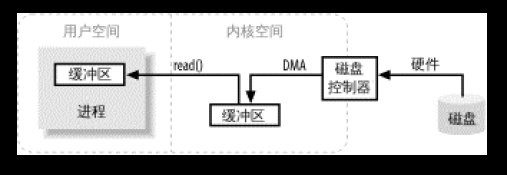
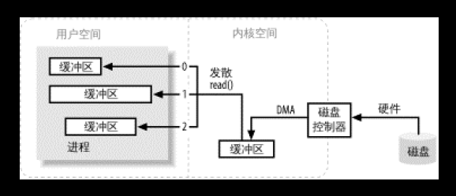

# Java NIO（siwang.hu&nbsp;&nbsp;V1.0）  
> + Java NIO(New IO)是一个可以替代标准Java IO API（从Java 1.4开始)，提供了与标准IO不同的IO工作方式  
>  
> + 标准的IO基于字节流和字符流进行操作的，而NIO是基于通道（Channel）和缓冲区（Buffer）进行操作，数据总是从通道读取到缓冲区中，或者从缓冲区写入到通道中  
>  
> + Java NIO可以让你非阻塞的使用IO  
>  
> + Java NIO引入了选择器的概念，选择器用于监听多个通道的事件（比如：连接打开，数据到达）。因此，单个的线程可以监听多个数据通道  
>  
## 核心部分  
> + channels（通道）  
> + Buffers（缓冲区）  
> + Selectors（选择器）  
## IO过程  
> 进程使用read( )系统调用，要求其缓冲区被填满。内核随即向磁盘控制硬件发出命令，要求其从磁盘读取数据。磁盘控制器把数据直接写入内核内存缓冲区，这一步通过DMA完成，无需主CPU协助。一旦磁盘控制器把缓冲区装满，内核即把数据从内核空间的临时缓冲区拷贝到进程执行read( )调用时指定的缓冲区  
>  
> 当进程请求I/O操作的时候，它执行一个系统调用（有时称为陷阱）将控制权移交给内核。C/C++程序员所熟知的底层方法open( )、read( )、write( )和close( )要做的无非就是建立和执行适当的系统调用。当内核以这种方式被调用，它随即采取任何必要步骤，找到进程所需数据，并把数据传送到用户空间内的指定缓冲区。内核试图对数据进行高速缓存或预读取，因此进程所需数据可能已经在内核空间里了。如果是这样，该数据只需简单地拷贝出来即可。如果数据不在内核空间，则进程被挂起，内核着手把数据读进内存  
>   
>  
>   
## IO模型  
> ### 1.阻塞IO模型  
> + 传统的一种IO模型，即在读写数据过程中会发生阻塞现象  
>  
> + 当用户线程发出IO请求之后，内核会去查看数据是否就绪，如果没有就绪就会等待数据就绪，而用户线程就会处于阻塞状态，用户线程交出CPU。当数据就绪之后，内核会将数据拷贝到用户线程，并返回结果给用户线程，用户线程才解除block状态  
```
data = socket.read();
```
> 如果数据没有就绪，就会一直阻塞在read方法  
> ### 2.非阻塞IO模型  
> + 当用户线程发起一个read操作后，并不需要等待，而是马上就得到了一个结果  
>  
> + 如果结果是一个error时，它就知道数据还没有准备好，于是它可以再次发送read操作。一旦内核中的数据准备好了，并且又再次收到了用户线程的请求，那么它马上就将数据拷贝到了用户线程，然后返回  
>  
> + 在非阻塞IO模型中，用户线程需要不断地询问内核数据是否就绪，也就说非阻塞IO不会交出CPU，而会一直占用CPU  
```
while(true){
    data = socket.read();
    if(data!= error){
        处理数据
        break;
    }
}
```
> ### 3.多路复用IO模型  
> + **Java NIO是多路复用IO模型**  
>  
> + 在多路复用IO模型中，会有一个线程不断去轮询多个socket的状态，只有当socket真正有读写事件时，才真正调用实际的IO读写操作。因为在多路复用IO模型中，只需要使用一个线程就可以管理多个socket，系统不需要建立新的进程或者线程，也不必维护这些线程和进程，并且只有在真正有socket读写事件进行时，才会使用IO资源，所以它大大减少了资源占用  
>  
> + 在Java NIO中，是通过selector.select()去查询每个通道是否有到达事件，如果没有事件，则一直阻塞在那里，因此这种方式会导致用户线程的阻塞  
>  
> + 多路复用IO模型是通过轮询的方式来检测是否有事件到达，并且对到达的事件逐一进行响应。因此对于多路复用IO模型来说，一旦事件响应体很大，那么就会导致后续的事件迟迟得不到处理，并且会影响新的事件轮询  
> ### 4.信号驱动IO模型  
> + 在信号驱动IO模型中，当用户线程发起一个IO请求操作，会给对应的socket注册一个信号函数，然后用户线程会继续执行，当内核数据就绪时会发送一个信号给用户线程，用户线程接收到信号之后，便在信号函数中调用IO读写操作来进行实际的IO请求操作  
> ### 5.异步IO模型  
> + 异步IO模型是最理想的IO模型  
>  
> + 在异步IO模型中，当用户线程发起read操作之后，立刻就可以开始去做其它的事  
>  
> + 从内核的角度，当它受到一个asynchronous read之后，它会立刻返回，说明read请求已经成功发起了，因此不会对用户线程产生任何block。然后，内核会等待数据准备完成，然后将数据拷贝到用户线程，当这一切都完成之后，内核会给用户线程发送一个信号，告诉它read操作完成了。也就说用户线程完全不需要实际的整个IO操作是如何进行的，只需要先发起一个请求，当接收内核返回的成功信号时表示IO操作已经完成，可以直接去使用数据了  
>  
> + 用户线程中不需要再次调用IO函数进行具体的读写。这点是和信号驱动模型有所不同的，在信号驱动模型中，当用户线程接收到信号表示数据已经就绪，然后需要用户线程调用IO函数进行实际的读写操作；而在异步IO模型中，收到信号表示IO操作已经完成，不需要再在用户线程中调用iO函数进行实际的读写操作  
>  
>   
## 多路复用IO模型  
> 我们总结IO过程主要分为两个过程:  
> + 应用层数据到kernel  
>  
> + kernel将数据复制到user space区  
>  
> 阻塞io模型就是将这个两个过程合并在一起，一起阻塞。而非阻塞模型则是将第一个过程的阻塞变成非阻塞，第二个阶段是系统调用，是必须阻塞的，所以非阻塞模型也是同步的，因为它们在kernel里的数据准备好之后，进行系统调用，将数据拷贝到进程缓冲区中  
### select模型  
> + 单个线程就可以同时处理多个网络连接的io请求  
>  
> + 基本原理：程序调用select，然后整个程序就阻塞了，这时候，kernel就会轮询检查所有select负责的fd，当找到一个client中的数据准备好了，select就会返回，这个时候程序就会系统调用，将数据从kernel复制到进程缓冲区  
>  
> **缺点**  
> + 根据fd_size的定义，它的大小为32个整数大小（32位机器为32*32，所有共有1024bits可以记录fd），每个fd一个bit，最大只能同时处理1024个fd  
>  
> + 每次要判断有哪些event发生这件事的成本很高，因为select（polling也是）采取主动轮询机制  
>  
> **假设现实中，有1百万个客户端同时与一个服务器保持着tcp连接，而每一个时刻，通常只有几百上千个tcp连接是活跃的，这时候我们仍然使用select/poll机制，kernel必须在搜寻完100万个fd之后，才能找到其中状态是active的，这样资源消耗大而且效率低下**  
### poll模型  
> + 工作原理与select模型一样  
>  
> + poll采用链式数据结构存储fd，没有最大连接数的限制  
>  
> + poll是水平触发的，也就是通知程序fd就绪后，这次没有被处理，那么下次poll的时候会再次通知同个fd已经就绪  
>  
### epoll模型  
>   
>  
> **epoll与select，poll的最大区别是，epoll模型不需要主动去检查管理的fd链接；当fd的数据就绪时，epoll模型会将就绪的fd加入一个队列中，epoll模型只需要直接处理这个就绪队列就可以了，省去了主动轮询每个fd的操作**  
>  
> + epoll没有fd数量限制 epoll没有这个限制，最大数量与能打开的fd数量有关，一个g的内存的机器上，能打开10万个左右  
>  
> + epoll不需要每次都从user space 将fd set复制到内核kernel epoll在用epoll_ctl函数进行事件注册的时候，已经将fd复制到内核中，所以不需要每次都重新复制一次  
>  
> + select和poll都是主动轮询机制，需要检查每一个fd；epoll是被动触发方式，给fd注册了相应事件的时候，我们为每一个fd指定了一个回调函数，当数据准备好之后，就会把就绪的fd加入一个就绪的队列中，epoll_wait的工作方式实际上就是在这个就绪队列中查看有没有就绪的fd，如果有，就唤醒就绪队列上的等待者，然后调用回调函数  
>  
> + select, poll是为了解決同时大量IO的情況（尤其网络服务器），但是随着连接数越多，性能越差  
>  
> + epoll是select和poll的改进方案，在linux上可以取代select和poll，可以处理大量连接的性能问题  
## Java NIO模型  
> + Java为了保证jvm的跨平台特性，无法保证select,poll,epoll对任意操作系统的全面支持，默认是采用select模型  
>  
> + 对于Linux平台下的jvm可以通过增加参数 **-Djava.nio.channels.spi.SelectorProvider=sun.nio.ch.EPollSelectorProvider**将nio使用Linux上的epoll模型
## channels    
>   
> NIO的所有IO都是从一个通道开始的。通道和流(Stream)有点类似，数据可以 从通道读出到缓冲区中，也可以从缓冲区写入到通道中  
> 主要channels:  
> + FileChanel  
> + DatagramChannel  
> + SocketChannel  
> + ServerSocketChannel  
> Java NIO实现涵盖了UDP+TCP网络IO，以及文件IO  
>  
> 使用FileChanel demo：
```
RandomAccessFile aFile = RandomAccessFile("data/nio-data.txt", "rw");
FileChannel inChannel = aFile.getChannel();
ByteBuffer buf = ByteBuffer.allocate(48);
int bytesRead = inChannel.read(buf);
while (bytesRead != -1) {
    System.out.println("\n=====Read " + bytesRead);
    buf.flip();
    while(buf.hasRemaining()){
        System.out.print((char) buf.get());
    }
    buf.clear();
    bytesRead = inChannel.read(buf);
}
aFile.close();
```
> buf.flip()调用。首先将数据读到缓冲区中，然后切换缓冲区为读模式，接着从缓冲区读数据
## buffer  
> 在Java NIO中核心缓冲区的实现类如下：
> + ByteBuffer
> + CharBuffer
> + DoubleBuffer
> + FloatBuffer
> + IntBuffer
> + LongBuffer
> + ShortBuffer
>  
> 这些缓冲区涵盖了可以通过NIO发送的基本数据类型：byte、
short、int、long、float、double、char。Java NIO中还有一个MappedByteBuffer实现，用来连接内存映射文件  
```
RandomAccessFile aFile = new RandomAccessFile("data/nio-data.txt", "rw");
FileChannel inChannel = aFile.getChannel();
//创建一个容量为48字节的缓冲区
ByteBuffer buf = ByteBuffer.allocate(48);
int bytesRead = inChannel.read(buf); //write：从通道中读出数据到缓冲区
while (bytesRead != -1) {
    buf.flip();  //flip: 将缓冲区切换到读模式
    while(buf.hasRemaining()){
      System.out.print((char) buf.get()); // read: 一次读取一字节
    }
    buf.clear(); //clear: 清空缓冲区，准备下次读入
    bytesRead = inChannel.read(buf);
}
aFile.close();
```
>  ### 缓冲区重要属性  
> position和limit具体含义取决于缓冲区是在读模式还是写模式  
> + 容量：capacity  
> 缓冲区中最多写入capacity这么多的byte，long，char类型的数据。一旦满了，就需要先清空（已读数据，或者全部清空）才能再往里面写入数据  
>  
> + 位置：position  
> 当往缓冲期里写数据时，总是会从某个位置(position)开始。刚开始时，position是0。当写入一个byte或者long类型的数据后，position会指向下一个可写入的位置。显然，postion的最大值等于capacity-1。当从缓冲区中读取数据时，也总是会从某个位置开始。当缓冲区从写模式切换到读模式后，postion会被重置为0。当从缓冲区中读取数据时，postion会指向下一个可读取的位置。  
>  
> + 上限：limit  
> 缓冲区的第一个不能被读或写的元素。或者说，缓冲区中现存元素的计数  
> 在写模式下，缓冲区的limit指的是可以往缓冲区里写入多少数据。即，写模式下limit和capacity的含义相同  
> 在读模式下，limit指的是可以从缓冲区中读出多少数据。因此，当缓冲区切换到读模式后，limit会设置为写模式时position的值  
>  
> ### 申请缓冲区空间
```
//申请大小为 48字节 的ByteBuffer
ByteBuffer buf = ByteBuffer.allocate(48);

//申请大小为 1024个字符 
CharBuffer buf = CharBuffer.allocate(1024);

```
>  ### 主要方法  
```
flip()   //将缓冲区从写模式切换为读模式，也就是将limit设置为position，然后重置position为0

channel.write(buf)  //从缓冲区中读取数据写入到通道中

buf.get()   //从缓冲区中读取数据

rewind()   //将position重置为0，重复读取缓冲区中的所有数据。而limit值不变，仍然表示缓冲区中可以读出多少个元素（字节、字符等等）

clear()  //清空所有数据并重置position等属性  

compact()  //会将所有未读数据复制到缓冲区开头，然后会将position设置为最后一个未读数据之后。而limit仍然会设置为capacity，就和clear()方法中的一样。现在，就可以继续往缓冲期写入而不会覆盖未读数据

mark() 和 reset()  //通过调用mark()方法，可以在缓冲区中的指定位置做打个标签，随后可以通过调用reset()方法将缓冲区的position重置到打标签的位置
```
> 
## Selectors  
>   
> 选择器可以让一个线程处理多个通道。当应用程序打开多个连接（Channel），需要先将Channel注册到选择器中，之后就可以调用它的select()方法。该方法一直阻塞到所注册通道中某个事件就绪为止。一旦方法返回，线程就可以处理这些事件。这些事件包括有连接进来，数据接收等  
> ### **创建选择器**  
```
Selector selector = Selector.open();
```
> ### **将通道注册到选择器中**  
```
channel.configureBlocking(false);
SelectionKey key = channel.register(selector, SelectionKey.OP_READ);
```
> 通道只有在非阻塞模式下才能使用选择器。这就意味着FileChannel是不能使用选择器的，原因是FileChannel是无法切换到非阻塞模式下的，而基于Socket的通道是可以的  
>   
> ### **SelectionKey**  
> register()方法的第二个参数。这是一个所谓的兴趣集合（interest set），意思是选择器对通道中的哪些事件感兴趣，以监听这类事件,可以监听的事件类型有四种：  
> + SelectionKey.OP_CONNECT  
> + SelectionKey.OP_ACCEPT  
> + SelectionKey.OP_READ  
> + SelectionKey.OP_WRITE  
```
int interestSet = SelectionKey.OP_READ | SelectionKey.OP_WRITE;
```
> 在将通道注册到选择器时，调用了register()方法，返回值为SelectionKey对象。SelectionKey对象包含了几个有意思的属性：  
> + 兴趣集合（interest set）  
> + 就绪状态集合（ready set） 
> + 通道 
> + 选择器  
> + 附加对象 (可选)  
> ### **兴趣集合（interest set）**  
```
int interestSet = selectionKey.interestOps();
boolean isInterestedInAccept  = interestSet & SelectionKey.OP_ACCEPT;
boolean isInterestedInConnect = interestSet & SelectionKey.OP_CONNECT;
boolean isInterestedInRead    = interestSet & SelectionKey.OP_READ;
boolean isInterestedInWrite   = interestSet & SelectionKey.OP_WRITE;
```
> 可以使用AND（与）操作来判断给定的集合中是否包含了某个事件  
>  
> ### **就绪状态集合（ready set）**  
```
selectionKey.isAcceptable();
selectionKey.isConnectable();
selectionKey.isReadable();
selectionKey.isWritable();
```
> 就绪状态集合（ready set），顾名思义，就是指通道中已经就绪的操作集合。在做出『选择』之后，主要就是对就绪状态集合进行操作  
>   
> ### **从selectionKey获取事件发生的对应通道**
```
Channel  channel  = selectionKey.channel();
Selector selector = selectionKey.selector();
```
> 访问SelectionKey中的通道和选择器很简单  
>  
> ### **附加对象**  
> 可以在SelectionKey中附加一个对象，以便于识别给定通道，或者为通道附加更多信息  
```
selectionKey.attach(theObject);
Object attachedObj = selectionKey.attachment();
```
>  
> ### **channel事件发生获取**  
> 一旦在选择器中注册了一个或者几个通道之后，就可以调用select()方法。这些方法会返回你感兴趣的事件已经就绪状态的通道，比如Connect，Accept，Read 或者 Write。换言之，如果想选择可以读取数据的通道，select()方法会返回那些Read就绪的通道。select()方法有下面几种重载模式：  
> + int select() - 会被阻塞到所注册的事件就绪为止  
>  
> + int select(long timeout) - 也会阻塞，但是可以设置阻塞超时时间（参数timeout）  
>  
> + int selectNow() - 不会阻塞，会立即返回任何就绪的通道  
>   
> int类型的返回值表示有多少个通道已经就绪，即，在最后一次调用select()方法后有多少通道已经就绪。假如调用了一次select()方法，返回了1，说明有一个通道已经就绪；此时再调用一次select()方法，又有一个Channel也变成就绪状态，则还是会返回1。如果不对第一次已经就绪的那个通道做任何处理的话，这时应该有两个通道是处于就绪状态的。但是在每次调用select()方法时，只会有一个通道变为就绪状态。  
>  
> 在调用select()方法后，其返回值说明有几个通道已经就绪，这时可以调用selectedKeys()方法，通过『已选择键集合』来访问这些通道，像这样：  
```
Set<SelectionKey> selectedKeys = selector.selectedKeys();
```
> 遍历『已选择键集合』就可以访问已经就绪的各个通道:  
```
Set<SelectionKey> selectedKeys = selector.selectedKeys();
Iterator<SelectionKey> keyIterator = selectedKeys.iterator();
while(keyIterator.hasNext()) {
    SelectionKey key = keyIterator.next();
    if(key.isAcceptable()) {
        // ServerSocketChannel可以接受连接
    } else if (key.isConnectable()) {
        // 已经连接到远程服务器
    } else if (key.isReadable()) {
        // 通道可以读取
    } else if (key.isWritable()) {
        // 通道可以写入
    }
    keyIterator.remove();
}
```
> 注意到在最后调用了keyIterator.remove()方法，在通道处理完成之后必须这样做的原因是选择器不会自己从已选择键集合中去掉SelectionKey实例。当下次通道就绪时，选择器会将它再次加入到已选择就绪集合中  
> SelectionKey.channel()返回的通道实例需要强制转换成要处理的通道类型，比如ServerSocketChannel或者SocketChannel等  
>  
```
Selector selector = Selector.open();
channel.configureBlocking(false);
SelectionKey key = channel.register(selector, SelectionKey.OP_READ);
while(true) {
  int readyChannels = selector.select();
  if(readyChannels == 0) continue;
  Set<SelectionKey> selectedKeys = selector.selectedKeys();
  Iterator<SelectionKey> keyIterator = selectedKeys.iterator();
  while(keyIterator.hasNext()) {
    SelectionKey key = keyIterator.next();
    if(key.isAcceptable()) {
        // ServerSocketChannel可以接受连接
    } else if (key.isConnectable()) {
        // 已经连接到远程服务器
    } else if (key.isReadable()) {
        // 通道可以读取
    } else if (key.isWritable()) {
        // 通道可以写入
    }
    keyIterator.remove();
  }
}
```
## 非阻塞Server实现  
```
public static void main(String[] args) {
    Selector selector = Selector.open();
    ServerSocketChannel channel = ServerSocketChannel.open();
    channel.configureBlocking(false);
    channel.socket().bind(new InetSocketAddress(port), 1024);
    channel.register(selector, SelectionKey.OP_ACCEPT);
    System.out.println("time server is run");
    while(true){
	    selector.select();
	    Set<SelectionKey> selectedKeys = selector.selectedKeys();
	    Iterator<SelectionKey> iterator = selectedKeys.iterator();
	    SelectionKey key = null;
	    while(iterator.hasNext()){
		    key = iterator.next();
		    iterator.remove();
		    try{
			    handleInput(key);
		    }catch (Exception e) {
			    if (key != null) {
				    key.cancel();
				    if (key.channel() != null)
				    key.channel().close();
			    }
		    }
	    }
        if(selector!=null){
	        try {
		        selector.close();
	        } catch (IOException e) {
		        e.printStackTrace();
	        }
        }
    }
}
void handleInput(SelectionKey key) throws IOException{
	if(key.isValid()){
		if(key.isAcceptable()){
			ServerSocketChannel schannel = (ServerSocketChannel) key.channel();
			SocketChannel accept = schannel.accept();
			accept.configureBlocking(false);
			accept.register(selector, SelectionKey.OP_READ);
		}
		if(key.isReadable()){
			SocketChannel sc = (SocketChannel) key.channel();
			ByteBuffer buffer = ByteBuffer.allocate(1024);
			int size = sc.read(buffer);  //非阻塞，数据已在内核空间准备好
			if(size>0){
				buffer.flip();
				byte[] arr = new byte[buffer.remaining()];
				buffer.get(arr);
				String body = new String(arr,"UTF-8");
				System.out.println(body);
				SimpleDateFormat format = new SimpleDateFormat("yyyy-MM-dd hh:mm:ss");
				byte[] bytes = res.getBytes();
			    ByteBuffer buffe = ByteBuffer.allocate(bytes.length);
			    buffe.put(bytes);
			    buffe.flip();
			    sc.write(buffe);
			}else if(size<0){
				key.cancel();
				sc.close();
			}
		}		
	}
}
```