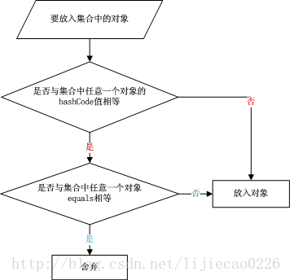

# Java基础（siwang.hu&nbsp;&nbsp;V1.0）  
## 类型提升  
> + 整数值默认就是int类型，只有在数值常量后面加“L”或“l”才表明该常量是long型  
> + 浮点数默认是double类型，只有在数值后面加上“f”或“F”才表明该常量是float类型  
>  
> Java语言支持的8中基本数据类型:  
> + byte  
> + short  
> + int  
> + long  
> + float  
> + double  
> + boolean  
> + char  
>  
> *String不是基本数据类型*  
>  
> **类型提升规则**  
> + byte、short和char类型的值都被提升为int类型  
> + 如果有一个操作数是long类型，就将整个表达式提升为long类型  
> + 如果有一个操作数是float类型，就将整个表达式提升为float类型  
> + 如果任何一个操作数为double类型，结果将为double类型  
>  
```
short s1 = 1;
s1 = s1 + 1;
```  
> s1+1运算中的操作数s1会被自动提升为int类型，s1+1运算结果会成为int类型，再赋值给short类型的s1时，编译器会报告需要强制转换类型的错误  
>  
```
short s1 = 1; 
s1 += 1;
```  
> +=是java语言中的运算符，Java编译器会对它特殊处理进行正确的编译  
> 
# equals与hashcode  
> + equals方法用于比较两个对象是否相等，比较的是对象的值(==比较的是对象引用)  
> + hashcode方法为对象生成唯一的哈希码  
>  
> *hashcode的作用是当对象放入HashTable，HashSet,HashMap等散列存储结构中时，为对象提供哈希码，指定对象的存储位置*  
>  
> 若重写了equals(Object obj)方法，则必要重写hashCode()方法  
>  
> 一般一个类的对象如果会存储在HashTable，HashSet,HashMap等散列存储结构中，那么重写equals后需要也重写hashCode，否则会导致存储数据的不唯一性（存储了两个equals相等的数据）  
> **对象放入散列集合的流程图**  
>   
> + hashCode是为了提高在散列结构存储中查找的效率，在线性表中没有作用  
>  
> + equals和hashCode需要同时覆盖  
>  
> + 若两个对象equals返回true，则hashCode有必要也返回相同的int数  
>  
> + 若两个对象equals返回false，则hashCode不一定返回不同的int数,但为不相等的对象生成不同hashCode值可以提高哈希表的性能  
>  
> + 若两个对象hashCode返回相同int数，则equals不一定返回true  
>  
> + 若两个对象hashCode返回不同int数，则equals一定返回false  
>  
> + 同一对象在执行期间若已经存储在集合中，则不能修改影响hashCode值的相关信息，否则会导致内存泄露问题  
## 泛型
> 泛型：JDK5引入了泛型机制，泛型实现了参数化类型的概念，使代码可以应用于多种类型；由编译器来保证类型的正确性。  
>  
> *基本类型无法作为泛型中的类型参数*  
> **泛型的优点:**  
> + 类型安全；泛型的主要目标是提高 Java 程序的类型安全  
> + 消除强制类型转换；消除源代码中的许多强制类型转换  
> + 潜在的性能收益  
>  
> **类型参数命令约定**  
> + K ----键，比如映射的键  
> + V ----值，比如 List 和 Set 的内容，或者 Map 中的值  
> + E ----异常类  
> + T ----泛型  
>  
> ## **类型擦除**  
> Java 泛型是使用擦除来实现的，使用泛型时，任何具体的类型信息都被擦除了。ArrayList<String> 和 ArrayList<Integer> 在运行时，JVM 将它们视为同一类型  
```
public class ErasedTypeEquivalence {
    public static void main(String[] args) {
        Class c1 = new ArrayList<String>().getClass();
        Class c2 = new ArrayList<Integer>().getClass();
        System.out.println(c1 == c2);
    }
}
```  
> 输出结果是 true  
## 序列化  
> + 序列化：将对象转换为字节流  
> + 反序列化：将字节流转换为对象  
>  
> Java通过对象输入输出流来实现序列化和反序列化  
> + java.io.ObjectOutputStream 类的 writeObject() 方法可以实现序列化  
> + java.io.ObjectInputStream 类的 readObject() 方法用于实现反序列化  
>  
> *被序列化的类必须属于 Enum、Array 和 Serializable类型其中的任何一种*  
>  
> **1.serialVersionUID**  
> serialVersionUID 是Java为每个序列化类产生的版本标识  
> serialVersionUID 字段必须是static final long类型  
>  
> **2.默认序列化机制**  
> &nbsp;&nbsp;&nbsp;&nbsp;如果仅仅只是让某个类实现 Serializable接口，而没有其它任何处理的话，那么就是使用默认序列化机制。使用默认机制，在序列化对象时，不仅会序列化当前对象本身，还会对其父类的字段以及该对象引用的其它对象也进行序列化。同样地，这些其它对象引用的另外对象也将被序列化，以此类推。所以，如果一个对象包含的成员变量是容器类对象，而这些容器所含有的元素也是容器类对象，那么这个序列化的过程就会较复杂，开销也较大。  
> *这里的父类和引用对象既然要进行序列化，那么它们当然也要满足序列化要求*  
>  
> **3.非默认序列化机制**  
```
public class SerializeDemo02 {
    static class Person implements Serializable {
        transient private Integer age = null;
        // 其他内容
    }
    // 其他内容
}
```  
> 当某个字段被声明为 transient 后，默认序列化机制就会忽略该字段,不会对其序列化  
>  
>   
>  