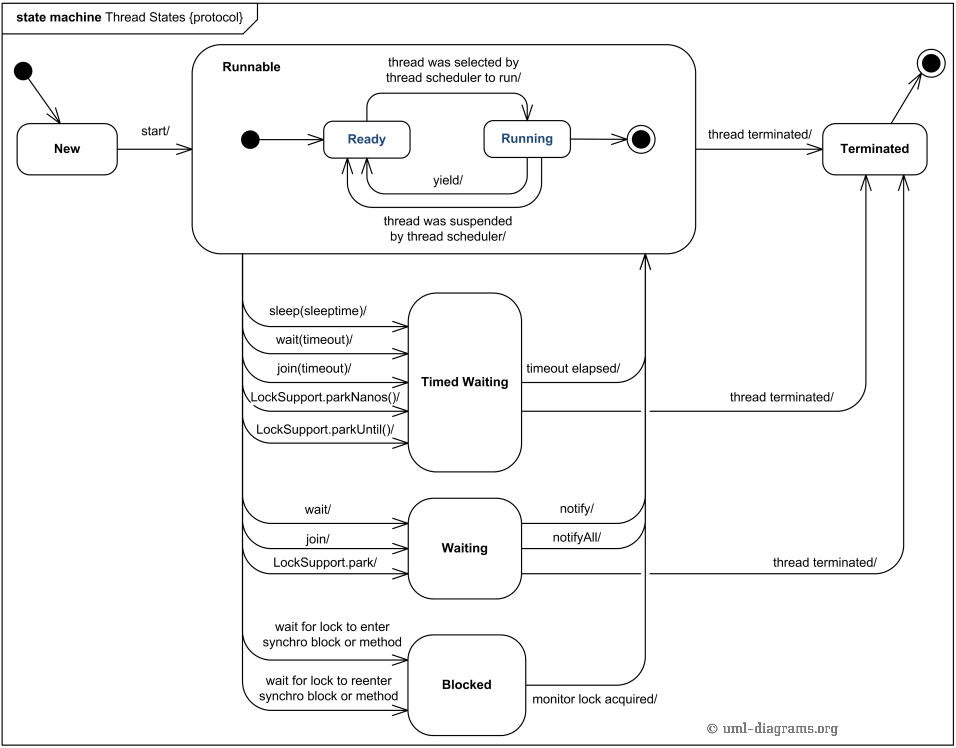

# Java多线程（siwang.hu&nbsp;&nbsp;V1.0）  
> ## **1.基本概念**  
> + 并发：交替执行多任务，不一定要同时  
>  
> + 并行：同时处理多个任务  
>  
> + 同步：程序发出一个调用，在没有得到结果之前，该调用就不返回，程序阻塞。但是一旦调用返回，就得到返回值了  
>  
> + 异步：程序发出一个调用，这个调用就直接返回了，没有返回结果。当一个异步过程调用发出后，调用者不会立刻得到结果。而是在调用发出后，被调用者通过状态、来通知调用者，或通过回调函数处理这个调用  
>  
> + 阻塞：是指调用结果返回之前，当前线程会被挂起。调用线程只有在得到结果之后才会返回  
>  
> + 非阻塞：指在不能立刻得到结果之前，该调用不会阻塞当前线程  
>  
> + 竞态条件：当两个线程竞争同一资源时，如果对资源的访问顺序敏感，就称存在竞态条件  
>  
> + 临界区：导致竞态条件发生的代码区称作临界区  
>  
> + 死锁：多个线程互相等待对方释放锁，从而进入无限期等待状态  
>  
> + 活锁：活锁指的是任务或者执行者没有被阻塞，由于某些条件没有满足，导致一直重复尝试—失败—尝试—失败的过程  
>  
> + 饥饿：线程一直无法获得运行资源，导致一直没有运行  
>  
> + 上下文切换： CPU 从执行一个线程切换到执行另一个线程时，CPU 需要保存当前线程的本地数据，程序指针等状态，并加载下一个要执行的线程的本地数据，程序指针等  
>  
> + 公平锁：多个线程按照申请锁的顺序来获取锁  
>  
> + 非公平锁：多个线程获取锁的顺序并不是按照申请锁的顺序，有可能后申请的线程比先申请的线程优先获取锁(Synchronized是一种非公平锁)  
>  
> + 可重入锁：在同一个线程在外层方法获取锁的时候，在进入内层方法会自动获取锁(Synchronized是一个可重入锁)  
>  
> + 独享锁：指该锁一次只能被一个线程所持有  
>  
> + 共享锁：指该锁可被多个线程所持有  
>  
> + 互斥锁：独享锁具体实现，在Java中是ReentrantLock类  
>  
> + 读写锁：Java 中的具体实现就是ReadWriteLock  
>  
> + 自旋锁：自旋锁是指尝试获取锁的线程不会立即阻塞，而是采用循环的方式去尝试获取锁  
>  
> ## **2.进程与线程的区别**  
>  
> + 进程代表一个正在运行的程序  
>  
> + 进程是操作系统进行资源分配的基本单位  
>  
> + 线程是操作系统进行调度的基本单位  
>  
> + 一个程序至少有一个进程，一个进程至少有一个线程  
>  
> + 线程比进程划分更细，执行开销更小，并发性更高  
>  
> + 进程是一个实体，拥有独立的资源；同一个进程中的多个线程共享进程的资源  
>  
> &nbsp;&nbsp;&nbsp;&nbsp;*JVM在单个进程中运行，JVM中的线程共享属于该进程的堆。这就是为什么几个线程可以访问同一个对象。线程共享堆并拥有自己的堆栈空间。这是一个线程如何调用一个方法以及它的局部变量是如何保持线程安全的。但是堆不是线程安全的并且为了线程安全必须进行同步*  
> ## **3.多线程的优缺点**  
> **优点：**  
> + 更好的资源利用
> + 更简单的编程模型  
> + 程序响应更灵敏  
>  
> **缺点：**  
> + 安全性问题(资源访问)  
> + 活跃性问题(死锁)  
> + 性能问题(上下文切换)  
>  
> ## **4.如何避免死锁与活锁**  
> + 加锁顺序  
> 确保所有的线程都是按照相同的顺序获得锁，那么死锁就不会发生  
>  
> + 加锁时限  
> 获取锁的时候加一个超时时间，这也就意味着在尝试获取锁的过程中若超过了这个时限该线程则放弃对该锁请求,回退并释放所有已经获得的锁  
>  
> + 死锁检测  
>  
> + 没有避免活锁的通用指南  
> 需要开发者自己小心设计代码逻辑  
# Java线程  
> java中定义了6种不同的线程状态，在给定的一个时刻，线程只能处于其中的一个状态：  
> + 开始（New）：还没有调用 start() 方法的线程处于此状态  
>  
> + 可运行（Runnable）：已经调用了start()方法的线程状态。此状态意味着，线程已经准备好了，一旦被线程调度器分配了CPU时间片，就可以运行线程  
>  
> + 阻塞（Blocked）：线程有可能会进入I/O交互，还可能调用sleep()方法，还有可能在当前线程当中有其它线程调用了join()方法，阻塞状态的线程是没有释放对象锁  
>  
> + 等待（Waiting）:一个线程处于等待状态，是由于执行了 3 个方法中的任意方法:Object.wait(),Thread.join()
LockSupport.park()  
>  
> + 定时等待（Timed waiting）：一个线程处于定时等待状态，是由于执行了以下方法中的任意方法：
Thread.sleep(sleeptime)
Object.wait(timeout)
Thread.join(timeout)
LockSupport.parkNanos(timeout)
LockSupport.parkUntil(timeout)  
>  
> + 终止(Terminated)：线程 run() 方法执行结束，或者因异常退出了 run() 方法，则该线程结束生命周期  
>  
>   
>  
# Java线程创建  
> + 继承Thread类  
> + 实现Runable接口  
> + 使用线程池(ThreadPoolExecutor)  
> + 实现callable接口  
```
public class CallableDemo {

    public static void main(String[] args) {
        Callable<Integer> callable = () -> new Random().nextInt(100);
        FutureTask<Integer> future = new FutureTask<>(callable);
        new Thread(future).start();
        try {
            Thread.sleep(1000);//可能做一些事情
            System.out.println(future.get());
        } catch (InterruptedException | ExecutionException e) {
            e.printStackTrace();
        }
    }
} 
```  
# Thread中的重要方法  
> + run - 线程的执行实体  
>  
> + start - 线程的启动方法  
>  
> + setName、getName - 可以通过 setName()、 getName() 来设置、获取线程名称  
>  
> + setPriority、getPriority - 在 Java 中，所有线程在运行前都会保持在就绪状态，那么此时，哪个线程优先级高，哪个线程就有可能被先执行。可以通过 setPriority、getPriority 来设置、获取线程优先级  
>  
> + setDaemon、isDaemon - 可以使用 setDaemon() 方法设置线程为守护线程；可以使用 isDaemon() 方法判断线程是否为守护线程  
>  
> + isAlive - 可以通过 isAlive 来判断线程是否启动  
>  
> + interrupt - 当一个线程运行时，另一个线程可以直接通过 interrupt() 方法中断其运行状态  
>  
> + join - 使用 join() 方法让一个线程强制运行，线程强制运行期间，其他线程无法运行，必须等待此线程完成之后才可以继续执行  
>  
> + Thread.sleep - 使用 Thread.sleep() 方法即可实现休眠  
>  
> + Thread.yield - 可以使用 Thread.yield() 方法将一个线程的操作暂时让给其他线程执行  
>  
# Java线程间通信  
> ## **Object**
> wait、notify、notifyAll 是 Object 类中的方法  
> + wait - 线程自动释放其占有的对象锁，并等待 notify  
> + notify - 唤醒一个正在 wait 当前对象锁的线程，并让它拿到对象锁  
>  
> + notifyAll - 唤醒所有正在 wait 前对象锁的线程  
> ## **管道**  
> 主要用于线程之间的数据传输，而传输的媒介为内存. 4 种具体实现：PipedOutputStream、PipedInputStream、PipedReader 和 PipedWriter，前两种面向字节，而后两种面向字符  
>  
> *ThreadLocal线程本地变量，ThreadLocal 为变量在每个线程中都创建了一个副本，那么每个线程可以访问自己内部的副本变量*  
```
public class Piped {

    public static void main(String[] args) throws Exception {
        PipedWriter out = new PipedWriter();
        PipedReader in = new PipedReader();
        // 将输出流和输入流进行连接，否则在使用时会抛出IOException
        out.connect(in);
        Thread printThread = new Thread(new Print(in), "PrintThread");
        printThread.start();
        int receive = 0;
        try {
            while ((receive = System.in.read()) != -1) {
                out.write(receive);
            }
        } finally {
            out.close();
        }
    }

    static class Print implements Runnable {

        private PipedReader in;

        Print(PipedReader in) {
            this.in = in;
        }

        public void run() {
            int receive = 0;
            try {
                while ((receive = in.read()) != -1) {
                    System.out.print((char) receive);
                }
            } catch (IOException e) {
                e.printStackTrace();
            }
        }
    }
}
```  
# Java并发底层实现  
> ## **1.synchronized**  
> 关键字 synchronized 可以保证在同一个时刻，只有一个线程可以执行某个方法或者某个代码块  
> **原理：**  
> + 对于普通同步方法，锁是当前实例对象  
> 造成其他的线程也无法调用当前类的其他同步方法  
>  
> + 对于静态同步方法，锁是当前类的 Class 对象  
>  
> + 对于同步方法块，锁是Synchonized 括号里配置的对象  
> 同步方法块是细粒度的同步，推荐使用这种写法  
> *注意：Java中的synchronized是可重入的，即一个线程得到一个对象锁后再次请求该对象锁，是永远可以拿到锁的*  
> ## **2.volatile**  
> volatile 是轻量级的 synchronized，它在多处理器开发中保证了共享变量的“可见性”  
>  
> 可见性的意思是当一个线程修改一个共享变量时，另外一个线程能读到这个修改的值  
>  
> 一旦一个共享变量（类的成员变量、类的静态成员变量）被 volatile 修饰之后，那么就具备了两层语义：保证了不同线程对这个变量进行操作时的可见性，即一个线程修改了某个变量的值，这新值对其他线程来说是立即可见的。禁止进行指令重排序。如果一个字段被声明成 volatile，Java 线程内存模型确保所有线程看到这个变量的值是一致的  
# Lock锁  
> **synchronized缺陷**  
> + 被synchronized修饰的方法或代码块，只能被一个线程访问。如果这个线程被阻塞，其他线程也只能等待
>  
> + synchronized 不能响应中断  
>  
> + synchronized 没有超时机制  
>  
> + synchronized 只能是非公平锁  
>  
> **Lock接口**  
```
public interface Lock {
    void lock();
    void lockInterruptibly() throws InterruptedException;
    boolean tryLock();
    boolean tryLock(long time, TimeUnit unit) throws InterruptedException;
    void unlock();
    Condition newCondition();
}
```  
> + lock() 方法的作用是获取锁。如果锁已被其他线程获取，则进行等待  
>  
> + tryLock() 方法的作用是尝试获取锁，如果成功，则返回 true；如果失败（即锁已被其他线程获取），则返回 false。也就是说，这个方法无论如何都会立即返回，获取不到锁时不会一直等待  
>  
> + lockInterruptibly() 方法比较特殊，当通过这个方法去获取锁时，如果线程正在等待获取锁，则这个线程能够响应中断，即中断线程的等待状态。也就使说，当两个线程同时通过 lock.lockInterruptibly() 想获取某个锁时，假若此时线程 A 获取到了锁，而线程 B 只有在等待，那么对线程 B 调用 threadB.interrupt() 方法能够中断线程 B 的等待过程。  
>*当一个线程获取了锁之后，是不会被 interrupt() 方法中断的。因为本身在前面的文章中讲过单独调用 interrupt() 方法不能中断正在运行过程中的线程，只能中断阻塞过程中的线程。因此当通过 lockInterruptibly() 方法获取某个锁时，如果不能获取到，只有进行等待的情况下，是可以响应中断的*  
>  
> + unlock() 方法的作用是释放锁  
>  
> ReentrantLock(可重入锁)是唯一实现了 Lock 接口的类  
> **ReadWriteLock 和 ReentrantReadWriteLock**  
> eadWriteLock 允许多个线程同时对其执行读操作，但是只允许一个线程对其执行写操作  
>  
> ReentrantReadWriteLock 实现了 ReadWriteLock 接口，所以它是一个读写锁  
>  
> **ReadWriteLock接口定义**  
```
public interface ReadWriteLock {
    /**
     * 返回用于读操作的锁
     */
    Lock readLock();

    /**
     * 返回用于写操作的锁
     */
    Lock writeLock();
}
```  
# Java中的多线程同步手段  
> + 同步方法  
> + 同步代码块  
> + 使用volatile变量  
> + 可重入锁  
> + 尽量使用局部变量  