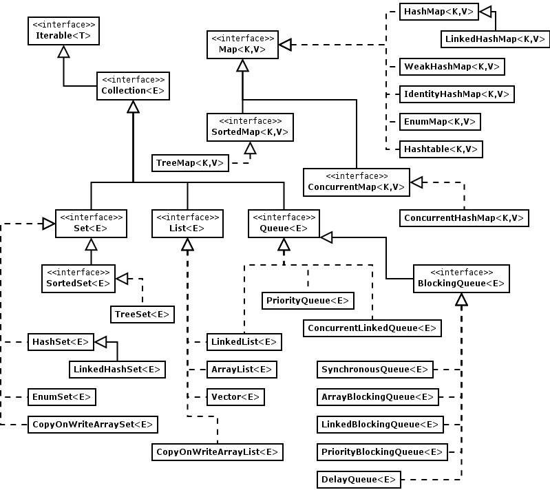

# Java容器（siwang.hu&nbsp;&nbsp;V1.0）  
> Java中常用的存储容器是数组与容器，但是两者有重大区别：  
> + 数组是固定长度的，容器的长度是可变的  
> + 数组可以存储基本数据类型，以可以存储引用数据类型；容器只能存储引用数据类型，基本数据类型要转成对应的包装类中才能放入容器  
>  ## **1.容器框架**
>   
>  
> Java 容器框架主要分为Collection和Map两种。其中，Collection又分为List、Set 、Queue    
> + Collection：一个独立元素的序列，这些元素都服从一条或者多条规则  
> + List：必须按照插入的顺序保存元素  
> + Set：不能有重复的元素  
> + Map：一组成对的“键值对”对象，允许你使用键来查找值  