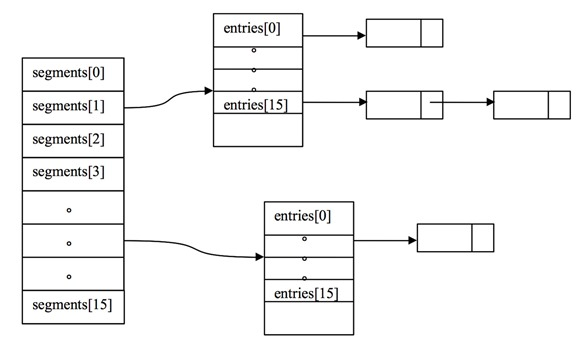

# Java容器（siwang.hu&nbsp;&nbsp;V1.0）  
> Java中常用的存储容器是数组与容器，但是两者有重大区别：  
> + 数组是固定长度的，容器的长度是可变的  
> + 数组可以存储基本数据类型，以可以存储引用数据类型；容器只能存储引用数据类型，基本数据类型要转成对应的包装类中才能放入容器  
>  ## **1.容器框架**
>   
>  
>   
>  
> Java 容器框架主要分为Collection和Map两种。其中，Collection又分为List、Set 、Queue    
> + Collection：一个独立元素的序列，这些元素都服从一条或者多条规则  
> + List：必须按照插入的顺序保存元素  
> + Set：不能有重复的元素  
> + Map：一组成对的“键值对”对象，允许你使用键来查找值  
> ## **set**  
> + TreeSet是采用树结构实现(红黑树算法)；元素是按顺序（不是插入顺序）进行排列，但是add()、remove()以及contains()等方法都是复杂度为O(log(n))。存入TreeMap的元素应当实现Comparable接口或者实现Comparator接口，会按照排序后的顺序迭代元素  
>  
> + HashSet是采用hash表来实现的。其中的元素没有按顺序排列，add()、remove()以及contains()等方法都是复杂度为O(1)  
>  
> + LinkedHashSet介于HashSet和TreeSet之间。它也是一个hash表，但是同时维护了一个双链表来记录插入的顺序。基本方法的复杂度为O(1)  
>  
> ## **Map**  
> + HashMap：底层是哈希表数据结构，允许使用 null 值和 null 键，该集合是不同步的。(同步使用hashtable替代)  
>  
> + TreeMap：底层是二叉树(红黑树算法)数据结构。线程不同步。可以用于给map集合中的键进行排序存入TreeMap的元素应当实现Comparable接口或者实现Comparator接口，会按照排序后的顺序迭代元素  
>  
> ## **List**  
> + ArrayList：数组，容量一大，频繁增删就是噩梦，适合随机查找  
>  
> + LinkedList：基于链表的数据结构  
>  
> + Vector：底层用数组实现的List，相关的方法都加了同步检查  
>  
> ## **String、StringBuilder、StringBuffer**  
> + String为字符串常量，而StringBuilder和StringBuffer均为字符串变量，即String对象一旦创建之后该对象是不可更改的，但后两者的对象是变量，是可以更改的  
>  
> + 在线程安全上，StringBuilder是线程不安全的，而StringBuffer是线程安全的  
>  
> + String：适用于少量的字符串操作的情况；StringBuilder：适用于单线程下在字符缓冲区进行大量操作的情况；StringBuffer：适用多线程下在字符缓冲区进行大量操作的情况  
>  
# 同步容器  
> + Vector 实现了 List 接口，Vector 实际上就是一个数组，和 ArrayList 类似，但是 Vector 中的方法都是 synchronized 方法，即进行了同步措施  
>  
> + Stack 也是一个同步容器，它的方法也用 synchronized 进行了同步，它实际上是继承于 Vector 类  
>  
> + HashTable 实现了 Map 接口，它和 HashMap 很相似，但是 HashTable 进行了同步处理，而 HashMap 没有  
>  
> + Collections 类中提供的静态工厂方法创建的类（由 Collections.synchronizedXxxx 等方法）  
>  
> + 字符串处理上，StringBuilder是线程不安全的，而StringBuffer是线程安全的  
>  
> *同步容器未必安全。在做复合操作(调用容器中的多个方法)时，仍然需要加锁来保护*  
# 并发容器  
> JDK 的 java.util.concurrent 包（即 juc）中提供了几个非常有用的并发容器  
> + CopyOnWriteArrayList - 线程安全的 ArrayList  
> + CopyOnWriteArraySet - 线程安全的 Set，它内部包含了一个 CopyOnWriteArrayList，因此本质上是由 CopyOnWriteArrayList 实现的  
> + ConcurrentSkipListSet - 相当于线程安全的 TreeSet。它是有序的 Set。它由 ConcurrentSkipListMap 实现  
> + ConcurrentHashMap - 线程安全的 HashMap。采用分段锁实现高效并发  
> + ConcurrentSkipListMap - 线程安全的有序 Map。使用跳表实现高效并发  
> + ConcurrentLinkedQueue - 线程安全的无界队列。底层采用单链表。支持 FIFO  
> + ConcurrentLinkedDeque - 线程安全的无界双端队列。底层采用双向链表。支持 FIFO 和 FILO  
> + ArrayBlockingQueue - 数组实现的阻塞队列  
> + LinkedBlockingQueue - 链表实现的阻塞队列  
> + LinkedBlockingDeque - 双向链表实现的双端阻塞队列  
# 同步容器与并发容器的区别  
>  + 同步容器：可以简单地理解为通过synchronized来实现同步的容器，如果有多个线程调用同步容器的方法，它们将会串行执行,在高并发环境下，程序执行效率很低  
>  
> + 同步类容器最大的缺点是读写都同步，这样在高并发环境下，性能非常的差  
>  
> + 并发容器：并发容器替换同步容器，是针对多个线程并发访问设计的,用很小的风险换得了可扩展性的提高  
>  
> + 并发容器并不能实时保证数据的一致性，它只能保证数据最终一致性  
>
> + 并发容器非常占用内存，因为写时需要复制一份副本，对象非常大时，容易触发gc  
>   
> + 并发容器适用于读操作多写操作少的场景  
# CopyOnWriteArrayList  
> &nbsp;&nbsp;&nbsp;&nbsp;Copy-On-Write简称COW，其基本思路是，从一开始大家都在共享同一个内容，当某个人想要修改这个内容的时候，才会真正把内容Copy出去形成一个新的内容然后再改，这是一种延时懒惰策略  
>  
> &nbsp;&nbsp;&nbsp;&nbsp;CopyOnWrite容器即写时复制的容器。当我们往一个容器添加元素的时候，不直接往当前容器添加，而是先将当前容器进行Copy，复制出一个新的容器，然后新的容器里添加元素，添加完元素之后，再将原容器的引用指向新的容器。这样做的好处是我们可以对CopyOnWrite容器进行并发的读，而不需要加锁，因为当前容器不会添加任何元素。所以CopyOnWrite容器也是一种读写分离的思想，读和写不同的容器  
>  
# ConcurrentHashMap  
>  &nbsp;&nbsp;&nbsp;&nbsp;ConcurrentHashMap本质上是一个Segment数组，而一个Segment实例又包含若干个桶，每个桶中都包含一条由若干个HashEntry对象链接起来的链表,ConcurrentHashMap是一个二级哈希表，单个Segment实际上就是传统意义上HashMap  
>   
> + 通过锁分段技术保证并发环境下的写操作  
> *ConcurrentHashMap当中每个Segment各自持有一把锁。在保证线程安全的同时降低了锁的粒度，让并发操作效率更高*
> + 通过HashEntry的不变性、Volatile变量的内存可见性和加锁重读机制保证高效、安全的读操作  
> + 通过不加锁和加锁两种方案控制跨段操作的的安全性  
>   
> + Case1：不同Segment的并发写入  
>  
>   
> *由于锁分段技术的采用，不同Segment的写入是可以并发执行的*  
>  
> + Case2：同一Segment的一写一读  
>  
>   
> *同一Segment的写和读是可以并发执行的*  
>  
> + Case3：同一Segment的并发写入  
>  
>   
> *Segment的写入是需要上锁的，因此对同一Segment的并发写入会被阻塞*  
>  
> Get方法：1.为输入的Key做Hash运算，得到hash值。2.通过hash值，定位到对应的Segment对象。3.再次通过hash值，定位到Segment当中数组的具体位置  
>  
> Put方法：1.为输入的Key做Hash运算，得到hash值。2.通过hash值，定位到对应的Segment对象。3.获取可重入锁。4.再次通过hash值，定位到Segment当中数组的具体位置。5.插入或覆盖HashEntry对象。6.释放锁  
> 