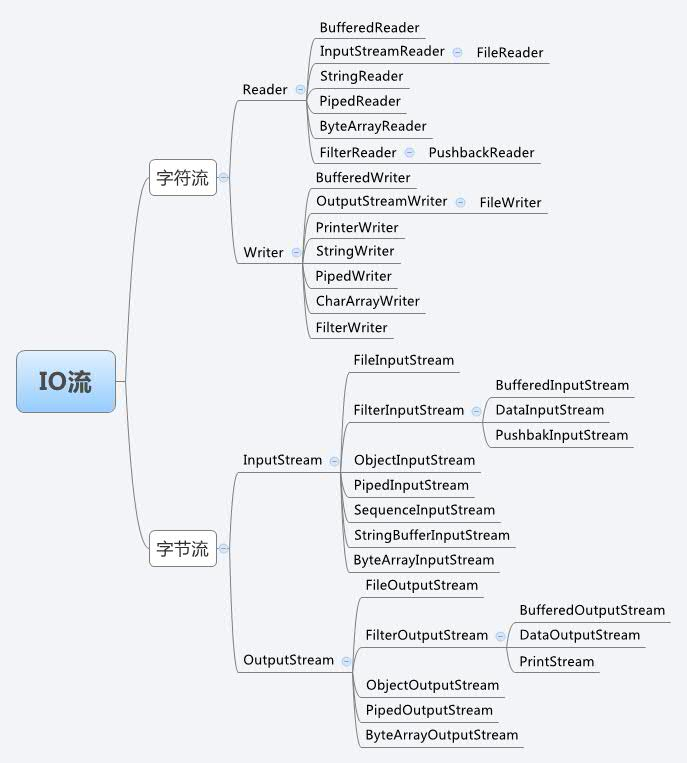

# Java流（siwang.hu&nbsp;&nbsp;V1.0)  
> ## **字符流与字节流**  
> Java IO中的流操作分为两类:
> + 字节流(byte)：主要是:InputStream（输入） 和 OutputStream（输出）  
> + 字符流：操作字符类型数据，一个字符占两个字节。主要是Reader（输入）和Writer（输出）  
> **流操作一般流程:**  
```
    1.使用File类绑定一个文件。
    2.把File对象绑定到流对象上。
    3.进行读或写操作。
    4.关闭流
```  
> + 字节流主要操作字节类型数据（byte）；字符流主要操作字符类型数据，一个字符占两个字节  
>  
> + 字节流在操作时本身不会用到缓冲区（内存），而是对文件本身直接操作的；字符流在操作时使用了缓冲区，通过缓冲区再操作文件  
>  ## **类框架图**
>   
>  
>  
>  + InputStream是所有的输入字节流的父类，它是一个抽象类，主要包含三个方法:
```
//读取一个字节并以整数的形式返回(0~255),如果返回-1已到输入流的末尾。 
int read() ； 
//读取一系列字节并存储到一个数组buffer，返回实际读取的字节数，如果读取前已到输入流的末尾返回-1。 
int read(byte[] buffer) ； 
//读取length个字节并存储到一个字节数组buffer，从off位置开始存,最多len， 返回实际读取的字节数，如果读取前以到输入流的末尾返回-1。 
int read(byte[] buffer, int off, int len) ；
```  
> + Reader 是所有的输入字符流的父类，它是一个抽象类，主要包含三个方法：  
```
//读取一个字符并以整数的形式返回(0~255),如果返回-1已到输入流的末尾。 
int read() ； 
//读取一系列字符并存储到一个数组buffer，返回实际读取的字符数，如果读取前已到输入流的末尾返回-1。 
int read(char[] cbuf) ； 
//读取length个字符,并存储到一个数组buffer，从off位置开始存,最多读取len，返回实际读取的字符数，如果读取前以到输入流的末尾返回-1。 
int read(char[] cbuf, int off, int len)
```  
> + OutputStream 是所有的输出字节流的父类，它是一个抽象类，主要包含如下四个方法：  
```
//向输出流中写入一个字节数据,该字节数据为参数b的低8位。 
void write(int b) ; 
//将一个字节类型的数组中的数据写入输出流。 
void write(byte[] b); 
//将一个字节类型的数组中的从指定位置（off）开始的,len个字节写入到输出流。 
void write(byte[] b, int off, int len); 
//将输出流中缓冲的数据全部写出到目的地。 
void flush();
```  
> + Writer 是所有的输出字符流的父类，它是一个抽象类,主要包含如下六个方法：  
```
//向输出流中写入一个字符数据,该字节数据为参数b的低16位。 
void write(int c); 
//将一个字符类型的数组中的数据写入输出流， 
void write(char[] cbuf) 
//将一个字符类型的数组中的从指定位置（offset）开始的,length个字符写入到输出流。 
void write(char[] cbuf, int offset, int length); 
//将一个字符串中的字符写入到输出流。 
void write(String string); 
//将一个字符串从offset开始的length个字符写入到输出流。 
void write(String string, int offset, int length); 
//将输出流中缓冲的数据全部写出到目的地。 
void flush()
```