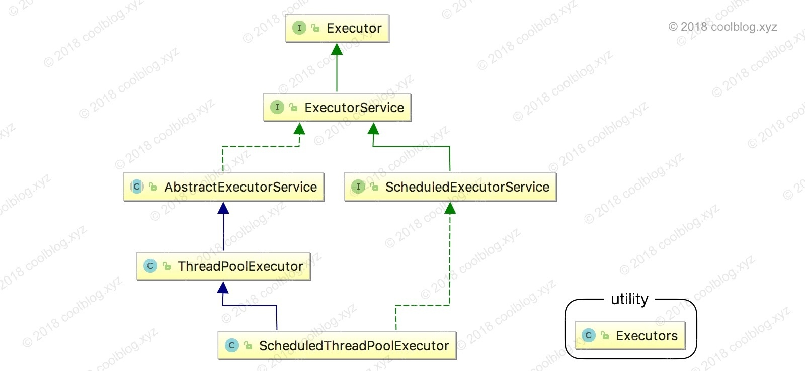

# Java线程池笔记（siwang.hu&nbsp;&nbsp;V1.0)  
> &nbsp;&nbsp;&nbsp;&nbsp;在实际开发中，如果每个请求到达服务器就创建一个新线程为其服务，开销是相当大的。服务器在创建和销毁线程上花费的时间和消耗的系统资源非常大，甚至可能要比在处理实际的用请求的时间和资源要多的多。除了创建和销毁线程的开销之外，活动的线程也需要消耗系统资源。如果在一个jvm里创建太多的线程，可能会使系统由于过度消耗内存或线程上下文切换过度而导致系统资源不足  
> &nbsp;&nbsp;&nbsp;&nbsp;线程池可以应对突然大爆发量的访问，通过有限个固定线程为大量的操作服务，减少创建和销毁线程所需的时间  
>  
> **使用线程池好处：**  
> + 降低资源消耗，通过重复利用已创建的线程降低线程创建和销毁造成的消耗  
>  
> + 提高响应速度，当任务到达时，任务可以不需要等到线程创建就能立即执行  
>  
> + 提高线程的可管理性，线程是稀缺资源，如果无限制的创建，不仅会消耗系统资源，还会降低系统的稳定性，使用线程池可以进行统一的分配，调优和监控  
>  
## 线程池类  
>   
>   
>   
>  
## 线程池的创建  
> *通过工具类Executors的静态方法来获取线程池*  
> ***
> ### newSingleThreadExecutor  
> **单例线程**，表示在任意的时间段内，线程池中只有一个线程在工作  
```
ExecutorService service = Executors.newSingleThreadExecutor();
```
> ***  
> ### newCacheThreadPool  
> **缓存线程池**，先查看线程池中是否有当前执行线程的缓存，如果有就resue(复用),如果没有,那么需要创建一个线程来完成当前的调用.并且这类线程池只能完成一些生存期很短的一些任务.并且这类线程池内部规定能resue(复用)的线程，空闲的时间不能超过60s,一旦超过了60s,就会被移出线程池  
```
ExecutorService service = Executors.newCacheThreadPool();
```
> ***  
> ### newFixedThreadPool  
> **固定型线程池**，和newCacheThreadPool()差不多，也能够实现resue(复用),但是这个池规定了线程的最大数量，也就是说当池有空闲时，那么新的任务将会在空闲线程中被执行，一旦线程池内的线程都在进行工作，那么新的任务就必须等待线程池有空闲的时候才能够进入线程池,其他的任务继续排队等待.这类池子没有规定其空闲的时间到底有多长.这一类的池更适用于服务器  
```
ExecutorService service = Executors.newFixedThreadPool(10);
```
> ***  
> ### newScheduledThreadPool  
> **调度型线程池**,调度型线程池会根据Scheduled(任务列表)进行延迟执行，或者是进行周期性的执行.适用于一些周期性的工作  
```
ExecutorService service = Executors.newScheduledThreadPool(10);
```  
> ### 例程  
```
import java.util.concurrent.ExecutorService;
import java.util.concurrent.Executors;

public class Test {
    public static void main(String[] args) {
        ExecutorService service = Executors.newCachedThreadPool();
        service.submit(new Runnable() {
            @Override
            public void run() {
                while(true){
                    System.out.println("hello world !");
                    try {
                        Thread.sleep(1000);
                    } catch (InterruptedException e) {
                        e.printStackTrace();
                    }
                }
            }
        });
        System.out.println("main Thread execute here ! " );
    }
}
```
## 提交任务  
> 任务分为两种:  
> 一种是有返回值的（**callable**），一种是没有返回值的（**runnable**）  
> Callable与 Future 两功能是Java在后续版本中为了适应多并法才加入的，Callable是类似于Runnable的接口，实现Callable接口的类和实现Runnable的类都是可被其他线程执行的任务  
> + 无返回值的任务就是一个实现了runnable接口的类，覆盖run方法  
>  
> + 有返回值的任务是一个实现了callable接口的类，覆盖call方法  
>  
> **区别**  
> + Callable定义的方法是call，而Runnable定义的方法是run  
>  
> + Callable的call方法可以有返回值，而Runnable的run方法不能有返回值  
>  
> + Callable的call方法可抛出异常，而Runnable的run方法不能抛出异常  
> ## 与Callable配套的Future  
> Future表示异步计算的结果，它提供了检查计算是否完成的方法，以等待计算的完成，并检索计算的结果  
> + **Future.get()会阻塞当前的线程，等待Callable执行结束获取返回值**  
>  
> + **Future的cancel方法可以取消任务的执行，它有一布尔参数，参数为 true 表示立即中断任务的执行，参数为 false 表示允许正在运行的任务运行完成**  
>  
```
import java.util.concurrent.Callable;
import java.util.concurrent.ExecutorService;
import java.util.concurrent.Executors;
import java.util.concurrent.Future;

public class CallableAndFuture {

    public static class  MyCallable  implements Callable{
        private int flag = 0;
        public MyCallable(int flag){
            this.flag = flag;
        }
        public String call() throws Exception{
            if (this.flag == 0){
                return "flag = 0";
            }
            if (this.flag == 1){
                try {
                    while (true) {
                        System.out.println("looping.");
                        Thread.sleep(2000);
                    }
                } catch (InterruptedException e) {
                    System.out.println("Interrupted");
                }
                return "false";
            } else {
                throw new Exception("Bad flag value!");
            }
        }
    }

    public static void main(String[] args) {
        // 定义3个Callable类型的任务
        MyCallable task1 = new MyCallable(0);
        MyCallable task2 = new MyCallable(1);
        MyCallable task3 = new MyCallable(2);
        // 创建一个执行任务的线程池
        ExecutorService es = Executors.newFixedThreadPool(3);
        try {
            // 提交并执行任务，任务启动时返回了一个Future对象，
            // 如果想得到任务执行的结果或者是异常可对这个Future对象进行操作
            Future future1 = es.submit(task1);
            // 获得第一个任务的结果，如果调用get方法，当前线程会等待任务执行完毕后才往下执行
            System.out.println("task1: " + future1.get());
            Future future2 = es.submit(task2);
            // 等待5秒后，再停止第二个任务。因为第二个任务进行的是无限循环
            Thread.sleep(5000);
            System.out.println("task2 cancel: " + future2.cancel(true));
            // 获取第三个任务的输出，因为执行第三个任务会引起异常
            // 所以下面的语句将引起异常的抛出
            Future future3 = es.submit(task3);
            System.out.println("task3: " + future3.get());
        } catch (Exception e){
            System.out.println(e.toString());
        }
        // 停止任务执行服务
        es.shutdownNow();
    }
}
```
> **线程池的execute与submit区别：**  
> + 接收的参数不一样,execut接收runnable；submit接收Callable  
>  
> + submit有返回值(Future对象)，而execute没有  
>  
> + submit方便Exception处理  
>  
> + execute是Executor接口中唯一定义的方法；submit是ExecutorService（该接口继承Executor）中定义的方法  
>  
## 关闭线程池  
> + shutdown()，shutdown并不是直接关闭线程池，而是不再接受新的任务…如果线程池内有任务，那么把这些任务执行完毕后，关闭线程池  
>  
> + shutdownNow()，这个方法表示不再接受新的任务，并把任务队列中的任务直接移出掉，如果有正在执行的，尝试进行停止  
## FutureTask  
> FutureTask除了实现Future接口外，还实现了Runnable接口。因此，FutureTask可以交给Executor执行，也可以由调用线程直接执行（FutureTask.run()）。  
```
public class Test {
    public static void main(String[] args) {
        //第一种方式
        ExecutorService executor = Executors.newCachedThreadPool();
        Task task = new Task();
        FutureTask<Integer> futureTask = new FutureTask<Integer>(task);
        executor.submit(futureTask);
        executor.shutdown();
         
        //第二种方式。一个是使用ExecutorService，一个使用的是Thread
        /*Task task = new Task();
        FutureTask<Integer> futureTask = new FutureTask<Integer>(task);
        Thread thread = new Thread(futureTask);
        thread.start();*/
         
        try {
            Thread.sleep(1000);
        } catch (InterruptedException e1) {
            e1.printStackTrace();
        }
         
        System.out.println("主线程在执行任务");
         
        try {
            System.out.println("task运行结果"+futureTask.get());
        } catch (InterruptedException e) {
            e.printStackTrace();
        } catch (ExecutionException e) {
            e.printStackTrace();
        }
         
        System.out.println("所有任务执行完毕");
    }
}
class Task implements Callable<Integer>{
    @Override
    public Integer call() throws Exception {
        System.out.println("子线程在进行计算");
        Thread.sleep(3000);
        int sum = 0;
        for(int i=0;i<100;i++)
            sum += i;
        return sum;
    }
}
```
## ThreadPoolExecutor  
> ThreadPoolExecutor是线程池的核心类,构造函数  
```
ThreadPoolExecutor(int corePoolSize, int maximumPoolSize, long keepAliveTime, TimeUnit unit, BlockingQueue<Runnable> workQueue)
```
> corePoolSize，核心线程数量，线程池刚创建时，线程数量为0，当每次执行execute添加新的任务时会在线程池创建一个新的线程，直到线程数量达到corePoolSize为止。  
>  
> workQueue，阻塞队列，当线程池正在运行的线程数量已经达到corePoolSize，那么再通过execute添加新的任务则会被加到workQueue队列中，在队列中排队等待执行，而不会立即执行。  
>  
> maximumPoolSize，最大线程数量，当workQueue队列已满，放不下新的任务，再通过execute添加新的任务则线程池会再创建新的线程，线程数量大于corePoolSize但不会超过maximumPoolSize，如果超过maximumPoolSize，那么会抛出异常，如RejectedExecutionException。  
>  
> keepAliveTime和unit，当线程池中线程数量大于workQueue，如果一个线程的空闲时间大于keepAliveTime，则该线程会被销毁。unit则是keepAliveTime的时间单位  
>  
> 
## Executor、ExecutorService、ThreadPoolExecutor区别  
> + 源码非常简单，只有一个execute（Runnable command）回调接口  
> + ExecutorService提供了管理终止的方法，以及可为跟踪一个或多个异步任务执行状况而生成Future的方法  
> + ThreadPoolExecutor是ExecutorService的一个实现类，它使用可能的几个池线程之一执行每个提交的任务，通常使用 Executors 工厂方法配置。