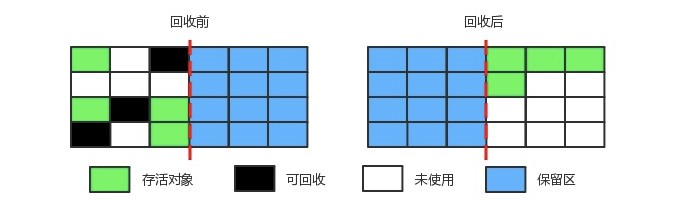

# Java虚拟机（siwang.hu&nbsp;&nbsp;V1.0）  
> + **jvm内存结构**    
> + **垃圾回收机制**  
> + **类加载机制**   
# jvm内存结构  
> jvm将运行时的内存划分为以下几块管理,分别是:  
> + **程序计数器**  
> + **虚拟机栈**  
> + **本地方法栈**  
> + **堆区**  
> + **方法区**  
> + **直接内存**  
> +   
> 其中程序计数器，虚拟机栈，本地方法栈是线程私有的  
> ## **1.程序计数器**  
> &nbsp;&nbsp;&nbsp;&nbsp;记录当前线程正在执行的Java虚拟机字节码指令的地址;如果当前执行的是本地方法，则为空。  
>  
> &nbsp;&nbsp;&nbsp;&nbsp;**此内存区域是唯一在Java虚拟机规范中没有规定任何OutOfMemoryError情况的区域**  
> ## **2.虚拟机栈**  
> &nbsp;&nbsp;&nbsp;&nbsp;每个 Java 方法在执行的同时会创建一个栈帧用于存储**局部变量表**、**操作数**、**常量池引用**、**对象引用**等信息。每一个方法从调用直至执行完成的过程，就对应着一个栈帧在 Java 虚拟机栈中入栈和出栈的过程。  
>  
> + **如果线程请求的栈深度大于虚拟机所允许的深度，将抛出StackOverflowError异常**  
>  
> + **如果虚拟机栈可以动态扩展，当扩展时无法申请到足够的内存时会抛出OutOfMemoryError异常**  
> + **java -Xss=512M JavaProgram可以指定虚拟机栈内存大小**  
> ## **3.本地方法栈**  
> &nbsp;&nbsp;&nbsp;&nbsp;本地方法栈（Native Method Stacks）与虚拟机栈所发挥的作用是非常相似的，其区别是虚拟机栈为虚拟机执行Java方法（也就是字节码）服务，而本地方法栈则是为虚拟机使用到的Native方法服务  
> ## **4.堆区**  
> + **Java中几乎所有的对象实例都在这里分配内存**  
> + **Java堆是所有线程共享的一块内存区域，虚拟机启动时创建**  
> + **堆中没有内存完成实例分配，并且堆也无法再扩展时，将会抛出OutOfMemoryError异常**  
> + **Java 堆不需要连续内存，并且可以动态增加其内存**  
>  
> 堆是垃圾收集的主要区域(GC堆),现代的垃圾收集器基本都是采用分代收集算法，该算法的思想是针对不同的对象采取不同的垃圾回收算法，因此虚拟机把Java堆分成以下三块:  
> &nbsp;&nbsp;&nbsp;&nbsp; **1.新生代(Young Generation)**  
> &nbsp;&nbsp;&nbsp;&nbsp; **2.老年代(Old Generation)**  
> &nbsp;&nbsp;&nbsp;&nbsp; **3.永久代(Permanent Generation)**  
> *永久代也就是jvm规范中定义的方法区，在官方jdk，hotspot中以永久代的形式实现方法区*  
>  
> 对象被创建时，首先进入新生代，之后有可能被转移到老年代中。新生代存放着大量的生命很短的对象，因此新生代在三个区域中垃圾回收的频率最高。为了更高效地进行垃圾回收，把新生代继续划分成以下三个空间：  
> &nbsp;&nbsp;&nbsp;&nbsp; **1.Eden**  
> &nbsp;&nbsp;&nbsp;&nbsp; **2.From Survivor**  
> &nbsp;&nbsp;&nbsp;&nbsp; **3.To Survivor**  
>   
> **java -Xms=1M(初始值) -Xmx=2M(最大值) JavaProgram**  
> ## **5.方法区**  
> + **用于存放已被加载的类信息、常量、静态变量、即时编译器编译后的代码等数据**  
> + **不需要连续的内存，并且可以动态扩展，动态扩展失败会抛出OutOfMemoryError异常**  
> + **运行时常量池是方法区的一部分**  
> *JDK1.7之前，HotSpot虚拟机把方法区当成永久代来进行垃圾回收，JDK1.8之后，取消了永久代，用 metaspace（元数据）区替代*  
> *除了在编译期生成的常量，还允许动态生成，例如 String 类的 intern()。这部分常量也会被放入运行时常量池*  
> ## **6.直接内存**  
> JDK 1.4 中新加入了 NIO 类，它可以使用 Native 函数库直接分配堆外内存，然后通过一个存储在 Java 堆里的 DirectByteBuffer 对象作为这块内存的引用进行操作。这样能在一些场景中显著提高性能，因为避免了在 Java 堆和 Native 堆中来回复制数据  
>  
>   
> ## **7.堆和栈的区别**  
>  &nbsp;&nbsp;&nbsp;&nbsp;在方法中定义的一些基本类型的变量和对象的引用变量都是在方法的栈内存中分配，Java在栈中为这个变量分配内存空间，当超过变量的作用域后，Java会自动释放掉为该变量分配的内存空间，该内存空间可以立即被另作它用  
>  
> &nbsp;&nbsp;&nbsp;&nbsp;堆内存用来存放由new创建的对象和数组，在堆中分配的内存，由Java虚拟机的自动垃圾回收器来管理。在堆中产生了一个数组或者对象之后，还可以在栈中定义一个特殊的变量，让栈中的这个变量的取值等于数组或对象在堆内存中的首地址，栈中的这个变量就成了数组或对象的引用变量，以后就可以在程序中使用栈中的引用变量来访问堆中的数组或者对象，引用变量就相当于是为数组或者对象起的一个名称。引用变量是普通的变量，定义时在栈中分配，引用变量在程序运行到其作用域之外后被释放。而数组和对象本身在堆中分配，即使程序运行到使用new产生数组或者对象的语句所在的代码块之外，数组和对象本身占据的内存不会被释放，数组和对象在没有引用变量指向它的时候，才变为垃圾，不能在被使用，但仍然占据内存空间不放，在随后的一个不确定的时间被垃圾回收器收走（释放掉)  
# 垃圾回收机制  
> jvm中程序计数器、虚拟机栈和本地方法栈这三个区域属于线程私有的，只存在于线程的生命周期内，线程结束之后也会消失，栈帧随着方法的进入和退出做入栈和出栈操作，实现了自动的内存清理，因此不需要对这三个区域进行垃圾回收。垃圾回收主要是针对Java堆和方法区进行  
> ## **1.对象存活判断**  
> + **引用计数算法:** 每个对象有一个引用计数属性，新增一个引用时计数加1，引用释放时计数减1，计数为0时可以回收。此方法简单，无法解决对象相互循环引用的问题  
> + **可达性分析算法:** 通过 GC Roots 作为起始点进行搜索，能够到达到的对象都是存活的，不可达的对象可被回收  
> + Java虚拟机使用可达性分析算法来判断对象是否可被回收  
>   
> 在Java中GC Roots一般包含以下内容:  
> &nbsp;&nbsp;&nbsp;&nbsp;**1.虚拟机栈中引用的对象**  
> &nbsp;&nbsp;&nbsp;&nbsp;**2.本地方法栈中引用的对象**  
> &nbsp;&nbsp;&nbsp;&nbsp;**3.方法区中类静态属性引用的对象**  
> &nbsp;&nbsp;&nbsp;&nbsp;**4.方法区中的常量引用的对象**  
> ## **2.垃圾收集算法**  
> **标记-清除算法**  
>   
> 将需要回收的对象进行标记，然后清理掉被标记的对象,不足:  
> + 标记和清除过程效率都不高  
> + 会产生大量不连续的内存碎片，导致无法给大对象分配内存  
>  
> **标记-整理算法**  
>   
> 让所有存活的对象都向一端移动，然后直接清理掉端边界以外的内存  
>  
> **复制算法**  
>   
> 将内存划分为大小相等的两块，每次只使用其中一块，当这一块内存用完了就将还存活的对象复制到另一块上面，然后再把使用过的内存空间进行一次清理。主要不足是只使用了内存的一半  
> *hotspot虚拟机采用复制算法来回收新生代，但是并不是将内存划分为大小相等的两块，而是分为一块较大的Eden空间和两块较小的Survior空间，每次使用 Eden空间和其中一块Survivor在回收时将Eden和 Survivor中还存活着的对象一次性复制到另一块 Survivor空间上，最后清理Eden和使用过的那一块 Survivor。HotSpot虚拟机的Eden和Survivor的大小比例默认为 8:1:1，保证了内存的利用率达到90%.如果每次回收有多于10%的对象存活，那么一块 Survivor 空间就不够用了，此时需要依赖于老年代进行分配担保，也就是借用老年代的空间存储放不下的对象*  
> ## **3.分代收集算法**  
> jvm堆区分为新生代，老年代，永久代。  
> + 新生代每次垃圾收集时有大批对象死去，只有少量存活，选用复制算法，只需要付出少量存活对象的复制成本就可以完成收集  
>  
> + 老年代中因为对象存活率高、没有额外空间对它进行分配担保，就必须使用“标记-清理”或“标记-整理”算法来进行回收  
> ## **4.内存分配与回收机制**  
> **回收机制**  
> 对象的内存分配，也就是在堆上分配。主要分配在新生代的 Eden 区上，少数情况下也可能直接分配在老年代中(例如大对象)  
>  
> jvm内存回收分为三种，分别是:  
> + Minor GC(回收新生代内存)  
> + Major GC(回收老年的内存)  
> + Full GC(回收整个堆空间内存)  
>  
> Minor GC触发条件：  
> + 当Eden区满时，触发Minor GC  
>  
> **因为新生代对象存活时间很短，因此Minor GC会频繁执行，执行的速度一般也会比较快**  
>    
> Full GC触发条件:  
> + 1.调用System.gc时，系统建议执行Full GC，但是不必然执行  
> + 2.老年代空间不足  
> + 3.方法区空间不足  
> + 4.通过Minor GC后进入老年代的平均大小大于老年代的可用内存  
> + 5.由Eden区、From Survivor区向To Survivor区复制时，对象大小大于To Survivor可用内存，则把该对象转存到老年代，且老年代的可用内存小于该对象大小  
>   
> **Full GC 很少执行，而且执行速度会比 Minor GC 慢很多**  
>  
> **分配机制**  
> + 对象优先在 Eden 分配  
> + 大对象直接进入老年代  
> + 长期存活的对象进入老年代(为对象定义年龄计数器，对象在Eden出生并经过Minor GC依然存活，将移动到Survivor中，年龄就增加1岁，增加到一定年龄则移动到老年代中)  
> + 动态对象年龄判定  
> + 空间分配担保  
> ## **5.垃圾收集器**  
> 垃圾收集器是jvm中内存回收的具体实现  
> + Serial收集器  
> 串行收集器只使用一个线程去回收。新生代、老年代使用串行回收；新生代复制算法、老年代标记-整理;垃圾收集的过程中会Stop The World(服务暂停)  
>   
>  
> + ParNew收集器  
> Serial 收集器的多线程版本  
>   
>  
> + Parallel Scavenge收集器  
> 与ParNew一样是并行的多线程收集器  
> 其它收集器关注点是尽可能缩短垃圾收集时用户线程的停顿时间，而它的目标是达到一个可控制的吞吐量，它被称为“吞吐量优先”收集器。这里的吞吐量指 CPU 用于运行用户代码的时间占总时间的比值。停顿时间越短就越适合需要与用户交互的程序，良好的响应速度能提升用户体验。而高吞吐量则可以高效率地利用 CPU 时间，尽快完成程序的运算任务，主要适合在后台运算而不需要太多交互的任务。  
>  
> + CMS收集器  
> 并发收集、低停顿。并发指的是用户线程和 GC 线程同时运行  
>   
> 初始标记：仅仅只是标记一下 GC Roots 能直接关联到的对象，速度很快，需要停顿  
> 并发标记：进行 GC Roots Tracing 的过程，它在整个回收过程中耗时最长，不需要停顿  
> 重新标记：为了修正并发标记期间因用户程序继续运作而导致标记产生变动的那一部分对象的标记记录，需要停顿  
> 并发清除：不需要停顿  
> + G1(Garbage-First)收集器  
> Java 堆被分为新生代、老年代和永久代，其它收集器进行收集的范围都是整个新生代或者老生代，而 G1 可以直接对新生代和永久代一起回收  
> G1 把新生代和老年代划分成多个大小相等的独立区域（Region），新生代和永久代不再物理隔离  
>   
> 通过记录每个 Region 记录垃圾回收时间以及回收所获得的空间（这两个值是通过过去回收的经验获得），并维护一个优先列表，每次根据允许的收集时间，优先回收价值最大的 Region  
>  
>   
> HotSpot 虚拟机中的7个垃圾收集器，连线表示垃圾收集器可以配合使用  
# 类加载机制  
> ## **1.类的生命周期**  
> + 加载  
> 加载阶段完成后，虚拟机外部的二进制字节流就按照虚拟机所需的格式存储在方法区之中，而且在Java堆中也创建一个java.lang.Class类的对象，这样便可以通过该对象访问方法区中的这些数据
> + 验证  
> 验证是连接阶段的第一步，这一阶段的目的是为了确保Class文件的字节流中包含的信息符合当前虚拟机的要求，并且不会危害虚拟机自身的安全  
> + 准备  
> 为类的静态变量分配内存，并将其初始化为默认值  
> + 解析  
> 解析阶段是虚拟机将常量池内的符号引用替换为直接引用的过程，解析动作主要针对类或接口、字段、类方法、接口方法、方法类型、方法句柄和调用点限定符7类符号引用进行(*直接引用就是直接指向目标的指针、相对偏移量或一个间接定位到目标的句柄*)  
> + 初始化  
> 初始化，为类的静态变量赋予正确的初始值，JVM负责对类进行初始化，主要对类变量进行初始化。在Java中对类变量进行初始值设定有两种方式：1.声明类变量是指定初始值
2.使用静态代码块为类变量指定初始值  
> + 使用  
> 开始使用类
> + 卸载  
>  在如下几种情况下，Java虚拟机将结束生命周期:1.执行了System.exit()方法;2.程序正常执行结束;3.程序在执行过程中遇到了异常或错误而异常终止;4.由于操作系统出现错误而导致Java虚拟机进程终止  
> 类加载有三种方式：  
> 1、命令行启动应用时候由JVM初始化加载  
> 2、通过Class.forName()方法动态加载  
> 3、通过ClassLoader.loadClass()方法动态加载  
> Class.forName()：将类的.class文件加载到jvm中之外，还会对类进行解释，执行类中的static块  
> ClassLoader.loadClass()：只干一件事情，就是将.class文件加载到jvm中，不会执行static中的内容,只有在newInstance才会去执行static块  
> ## **2.双亲委派模型**  
> &nbsp;&nbsp;&nbsp;&nbsp;双亲委派模型的工作流程是：如果一个类加载器收到了类加载的请求，它首先不会自己去尝试加载这个类，而是把请求委托给父加载器去完成，依次向上，因此，所有的类加载请求最终都应该被传递到顶层的启动类加载器中，只有当父加载器在它的搜索范围中没有找到所需的类时，即无法完成该加载，子加载器才会尝试自己去加载该类  
>  
> 双亲委派机制:  
> + 1.当AppClassLoader加载一个class时，它首先不会自己去尝试加载这个类，而是把类加载请求委派给父类加载器ExtClassLoader去完成  
> + 2.当ExtClassLoader加载一个class时，它首先也不会自己去尝试加载这个类，而是把类加载请求委派给BootStrapClassLoader去完成  
> + 3.如果BootStrapClassLoader加载失败（例如在$JAVA_HOME/jre/lib里未查找到该class），会使用ExtClassLoader来尝试加载  
> + 4.若ExtClassLoader也加载失败，则会使用AppClassLoader来加载，如果AppClassLoader也加载失败，则会报出异常ClassNotFoundException  
>  
>   
> *注意：这里父类加载器并不是通过继承关系来实现的，而是采用组合实现的*  
>  
>   
>  
