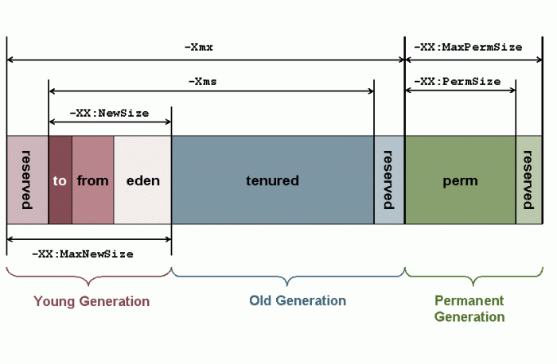
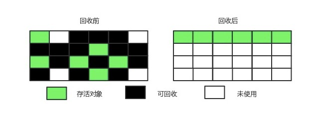

# Java虚拟机  
> + **jvm内存结构**    
> + **垃圾回收机制**  
> + **类加载机制**  
> + **JVM调优**  
# jvm内存结构  
> jvm将运行时的内存划分为以下几块管理,分别是:  
> + **程序计数器**  
> + **虚拟机栈**  
> + **本地方法栈**  
> + **堆区**  
> + **方法区**  
> + **直接内存**  
> +   
> 其中程序计数器，虚拟机栈，本地方法栈是线程私有的  
> ## **1.程序计数器**  
> &nbsp;&nbsp;&nbsp;&nbsp;记录当前线程正在执行的Java虚拟机字节码指令的地址;如果当前执行的是本地方法，则为空。  
>  
> &nbsp;&nbsp;&nbsp;&nbsp;**此内存区域是唯一在Java虚拟机规范中没有规定任何OutOfMemoryError情况的区域**  
> ## **2.虚拟机栈**  
> &nbsp;&nbsp;&nbsp;&nbsp;每个 Java 方法在执行的同时会创建一个栈帧用于存储**局部变量表**、**操作数**、**常量池引用**、**对象引用**等信息。每一个方法从调用直至执行完成的过程，就对应着一个栈帧在 Java 虚拟机栈中入栈和出栈的过程。  
>  
> + **如果线程请求的栈深度大于虚拟机所允许的深度，将抛出StackOverflowError异常**  
>  
> + **如果虚拟机栈可以动态扩展，当扩展时无法申请到足够的内存时会抛出OutOfMemoryError异常**  
> + **java -Xss=512M JavaProgram可以指定虚拟机栈内存大小**  
> ## **3.本地方法栈**  
> &nbsp;&nbsp;&nbsp;&nbsp;本地方法栈（Native Method Stacks）与虚拟机栈所发挥的作用是非常相似的，其区别是虚拟机栈为虚拟机执行Java方法（也就是字节码）服务，而本地方法栈则是为虚拟机使用到的Native方法服务  
> ## **4.堆区**  
> + **Java中几乎所有的对象实例都在这里分配内存**  
> + **Java堆是所有线程共享的一块内存区域，虚拟机启动时创建**  
> + **堆中没有内存完成实例分配，并且堆也无法再扩展时，将会抛出OutOfMemoryError异常**  
> + **Java 堆不需要连续内存，并且可以动态增加其内存**  
>  
> 堆是垃圾收集的主要区域(GC堆),现代的垃圾收集器基本都是采用分代收集算法，该算法的思想是针对不同的对象采取不同的垃圾回收算法，因此虚拟机把Java堆分成以下三块:  
> &nbsp;&nbsp;&nbsp;&nbsp; **1.新生代(Young Generation)**  
> &nbsp;&nbsp;&nbsp;&nbsp; **2.老年代(Old Generation)**  
> &nbsp;&nbsp;&nbsp;&nbsp; **3.永久代(Permanent Generation)**  
> *永久代也就是jvm规范中定义的方法区，在官方jdk，hotspot中以永久代的形式实现方法区*  
>  
> 对象被创建时，首先进入新生代，之后有可能被转移到老年代中。新生代存放着大量的生命很短的对象，因此新生代在三个区域中垃圾回收的频率最高。为了更高效地进行垃圾回收，把新生代继续划分成以下三个空间：  
> &nbsp;&nbsp;&nbsp;&nbsp; **1.Eden**  
> &nbsp;&nbsp;&nbsp;&nbsp; **2.From Survivor**  
> &nbsp;&nbsp;&nbsp;&nbsp; **3.To Survivor**  
>   
> **java -Xms=1M(初始值) -Xmx=2M(最大值) JavaProgram**  
> ## **5.方法区**  
> + **用于存放已被加载的类信息、常量、静态变量、即时编译器编译后的代码等数据**  
> + **不需要连续的内存，并且可以动态扩展，动态扩展失败会抛出OutOfMemoryError异常**  
> + **运行时常量池是方法区的一部分**  
> *JDK1.7之前，HotSpot虚拟机把方法区当成永久代来进行垃圾回收，JDK1.8之后，取消了永久代，用 metaspace（元数据）区替代*  
> *除了在编译期生成的常量，还允许动态生成，例如 String 类的 intern()。这部分常量也会被放入运行时常量池*  
> ## **6.直接内存**  
> JDK 1.4 中新加入了 NIO 类，它可以使用 Native 函数库直接分配堆外内存，然后通过一个存储在 Java 堆里的 DirectByteBuffer 对象作为这块内存的引用进行操作。这样能在一些场景中显著提高性能，因为避免了在 Java 堆和 Native 堆中来回复制数据  
# 垃圾回收机制  
> jvm中程序计数器、虚拟机栈和本地方法栈这三个区域属于线程私有的，只存在于线程的生命周期内，线程结束之后也会消失，栈帧随着方法的进入和退出做入栈和出栈操作，实现了自动的内存清理，因此不需要对这三个区域进行垃圾回收。垃圾回收主要是针对Java堆和方法区进行  
> ## **1.对象存活判断**  
> + **引用计数算法:** 每个对象有一个引用计数属性，新增一个引用时计数加1，引用释放时计数减1，计数为0时可以回收。此方法简单，无法解决对象相互循环引用的问题  
> + **可达性分析算法:** 通过 GC Roots 作为起始点进行搜索，能够到达到的对象都是存活的，不可达的对象可被回收  
> + Java虚拟机使用可达性分析算法来判断对象是否可被回收  
>   
> 在Java中GC Roots一般包含以下内容:  
> &nbsp;&nbsp;&nbsp;&nbsp;**1.虚拟机栈中引用的对象**  
> &nbsp;&nbsp;&nbsp;&nbsp;**2.本地方法栈中引用的对象**  
> &nbsp;&nbsp;&nbsp;&nbsp;**3.方法区中类静态属性引用的对象**  
> &nbsp;&nbsp;&nbsp;&nbsp;**4.方法区中的常量引用的对象**  
> ## **2.垃圾收集算法**  
> **标记-清除算法**  
>   
> 将需要回收的对象进行标记，然后清理掉被标记的对象,不足:  
> + 标记和清除过程效率都不高  
> + 会产生大量不连续的内存碎片，导致无法给大对象分配内存  
>  
> **标记-整理算法**  
>   
> 让所有存活的对象都向一端移动，然后直接清理掉端边界以外的内存  
>  
> **复制算法**  
>   
> 将内存划分为大小相等的两块，每次只使用其中一块，当这一块内存用完了就将还存活的对象复制到另一块上面，然后再把使用过的内存空间进行一次清理。主要不足是只使用了内存的一半  
> *hotspot虚拟机采用复制算法来回收新生代，但是并不是将内存划分为大小相等的两块，而是分为一块较大的Eden空间和两块较小的Survior空间，每次使用 Eden空间和其中一块Survivor在回收时将Eden和 Survivor中还存活着的对象一次性复制到另一块 Survivor空间上，最后清理Eden和使用过的那一块 Survivor。HotSpot虚拟机的Eden和Survivor的大小比例默认为 8:1:1，保证了内存的利用率达到90%.如果每次回收有多于10%的对象存活，那么一块 Survivor 空间就不够用了，此时需要依赖于老年代进行分配担保，也就是借用老年代的空间存储放不下的对象*  
> ## **3.分代收集算法**  
> jvm堆区分为新生代，老年代，永久代。  
> + 新生代每次垃圾收集时有大批对象死去，只有少量存活，选用复制算法，只需要付出少量存活对象的复制成本就可以完成收集  
>  
> + 老年代中因为对象存活率高、没有额外空间对它进行分配担保，就必须使用“标记-清理”或“标记-整理”算法来进行回收  
> ## **4.内存分配与回收机制**  
> **回收机制**  
> 对象的内存分配，也就是在堆上分配。主要分配在新生代的 Eden 区上，少数情况下也可能直接分配在老年代中(例如大对象)  
>  
> jvm内存回收分为三种，分别是:  
> + Minor GC(回收新生代内存)  
> + Major GC(回收老年的内存)  
> + Full GC(回收整个堆空间内存)  
>  
> Minor GC触发条件：  
> + 当Eden区满时，触发Minor GC  
>  
> **因为新生代对象存活时间很短，因此Minor GC会频繁执行，执行的速度一般也会比较快**  
>    
> Full GC触发条件:  
> + 1.调用System.gc时，系统建议执行Full GC，但是不必然执行  
> + 2.老年代空间不足  
> + 3.方法区空间不足  
> + 4.通过Minor GC后进入老年代的平均大小大于老年代的可用内存  
> + 5.由Eden区、From Survivor区向To Survivor区复制时，对象大小大于To Space可用内存，则把该对象转存到老年代，且老年代的可用内存小于该对象大小  
>   
> **Full GC 很少执行，而且执行速度会比 Minor GC 慢很多**  
>  
> **分配机制**  
> + 对象优先在 Eden 分配  
> + 大对象直接进入老年代  
> + 长期存活的对象进入老年代(为对象定义年龄计数器，对象在Eden出生并经过Minor GC依然存活，将移动到Survivor中，年龄就增加1岁，增加到一定年龄则移动到老年代中)  
> + 动态对象年龄判定  
> + 空间分配担保  