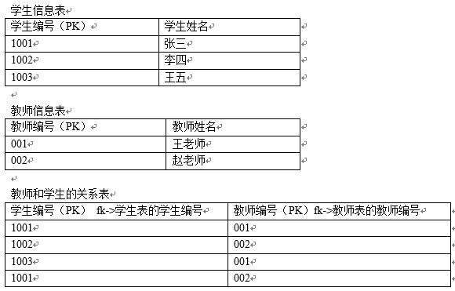
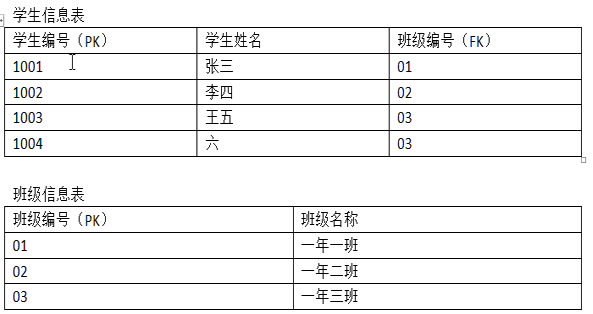
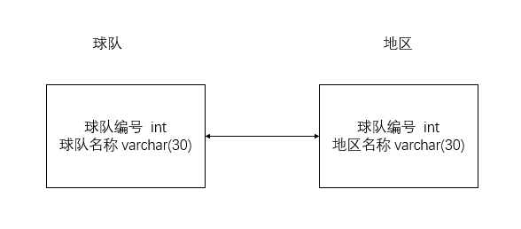
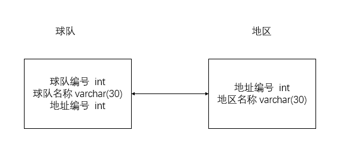
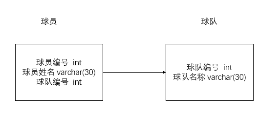
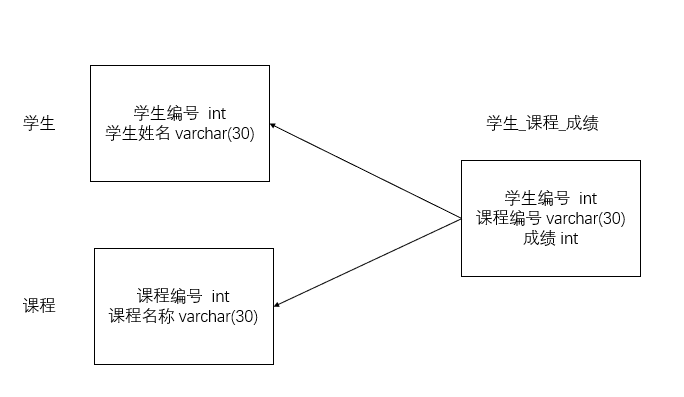

# mysql笔记（siwang.hu&nbsp;&nbsp;V1.0）  
## 数据库设计范式  
### 第一范式（1NF）  
> + 第一范式（1NF）是指关系型数据库表的每一列都是不可分割的基本数据项（不允许表中有表）  
>  
> + 数据库表中不能出现重复记录，每个字段是原子性的不能再分  
>  
> + 第一范式（1NF）是对关系模式的基本要求，不满足第一范式（1NF）的数据库就不是关系数据库  
>  
### 第二范式（2NF）  
> + 满足第二范式（2NF）必须先满足第一范式（1NF）  
>  
> + 第二范式要求所有非主键字段完全依赖主键，不能产生部分依赖  
>  
> + 所谓完全依赖是指不能存在仅依赖主关键字一部分的属性，如果存在，那么这个属性和主关键字的这一部分应该分离出来形成一个新的实体，新实体与原实体之间是一对多的关系  
>  
> **示例**  
>   
> 上表中学生编号与教师编号一起组成主键，但此表会出现大量的冗余，主要涉及到的冗余字段为“学生姓名”和“教师姓名”，出现冗余的原因在于，学生姓名部分依赖了主键的一个字段学生编号，而没有依赖教师编号，而教师姓名部分依赖了主键的一个字段教师编号  
> **解决**  
>   
> 如果一个表是单一主键，那么它就一定复合第二范式，部分依赖和表中主键设计复杂有关系
### 第三范式（3NF）  
> + 第三范式（3NF）必须先满足第二范式（2NF）  
>  
> + 第三范式（3NF）非主键字段不能传递依赖于主键字段（不要产生传递依赖）
>  
> **示例**  
>   
> 上表中学生编号是主键，班级名称字段存在冗余，因为班级名称字段没有直接依赖于主键，班级名称字段依赖于班级编号，班级编号依赖于学生编号，这就是传递依赖，解决的办法就是将冗余字段单独拿出来建立表  
> **解决**  
>   
>   
## 数据库常见设计  
### 一对一关系  
> + 第一种方案：分两张表存储，共享主键  
>  
> + 第二种方案：分两张表存储，外键唯一  
>  
> **示例**  
> 假设NBA球队与所属地区是一对一关系，一个地区拥有一支球队，一支球队归属一个地区  
> **第一张方案设计:**  
>   
>  
> **第二种方案设计:**  
>   
### 一对多关系  
> + 分两张表存储，在多的一方添加外键，这个外键字段引用一的一方中的主键字段  
>  
> **示例**  
> 假设NBA球队与球员是一对多的关系，NBA中一个球员只归属于一支球队，一支球队拥有多名球员  
> **方案设计**  
>   
### 多对多关系  
> + 分三张表存储，两张表分别存储实体信息，另外一张表存储两个实体的对应关系  
>  
> **示例**  
> 假设学生与选修课之间的关系是多对多的关系，一个学生可以选择多门选修课，而每个选修课又可以被多名学生选择  
> **方案设计**  
>   
## 实际场景设计建议  
> + 实际应用场景中，尤其是OLTP型数据库。 第三范式也有缺点：查询时经常需要大量的Join，导致查询效率不高。 所以有时候为了性能的考虑，适度的违反第三范式，做适当的冗余设计  
>  
```
OLTP，联机事务处理，可以理解为关系型数据库。
OLAP，联机分析处理，可以理解为数据仓库。
```
>  
> + 适当建立索引  
> 索引的字段必须是经常作为查询条件的字段，因为查询速度的提高是以更新、创建、删除的性能为代价的  
>  
> + 对表进行水平切分  
> 比如数据条数很多，上千万级别，而且系统界面中只提供按月份进行查询，那么就可以考虑将大表水平拆分为12个表  
>  
> + 对表进行垂直切分  
> 如果表的字段非常多，会占用大量的空间，检索表时需要执行大量I/O，影响性能。这时可以把一些字段切分到另一个表，新表和旧表是一对一映射。如果有些字段不常用又很长，那更应该拆分出去  
>  
> + 选择适当的字段类型  
> 主键用自增，timestamp只用4字节而datetime用8字节。文件、图片存储在文件系统中，数据库中只保存路径。外键要表示清楚，这样可以方便建立索引  
>  
> + 选择合适的存储引擎
> innodb、myisam、memory等  
> **MyISAM**  
> 锁级别为表锁，表锁优点是开销小，加锁快；缺点是锁粒度大，发生锁冲动概率较高，容纳并发能力低，这个引擎适合查询为主的业务,此引擎不支持事务，也不支持外键,能够快速读取操作  
> **InnoDB**  
> 锁级别为行锁，行锁优点是适用于高并发的频繁表修改，高并发是性能优于 MyISAM。缺点是系统消耗较大，索引不仅缓存自身，也缓存数据，相比 MyISAM 需要更大的内存
>  
> + 用集中批量操作代替频繁读写,这样可以减少IO  
>  
> + 读写分离  
> master-slave架构，从多台slave读数据，向一台master写入数据  
>  
> + SQL语句优化  
> 记录执行时间长的sql语句，便于后面分析，优化程序查询设计  
## sql常见语句  
> [参考](http://www.runoob.com/mysql/mysql-tutorial.html)
> + 创建数据库并指定编码  
> create database voices character set utf8 collate utf8_general_ci;  
>  
> + 删除数据库  
> drop database voices  
>  
> + 备份数据库  
> mysqldump -u root -p --databases voices > test.dump  
>  
> + 创建新表  
> create table tabname(col1 type1 [not null] [primary key],col2 type2 [not null],..)  
>  
> + 删除新表  
> drop table tabname  
>  