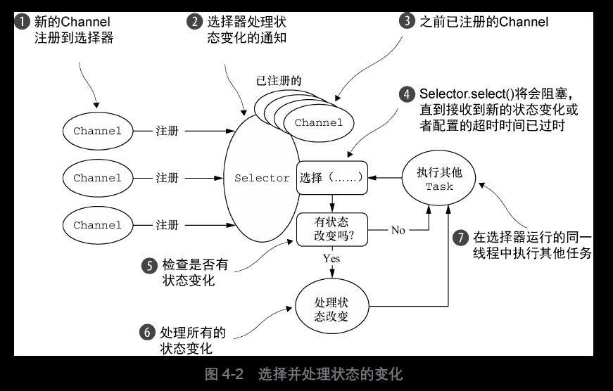
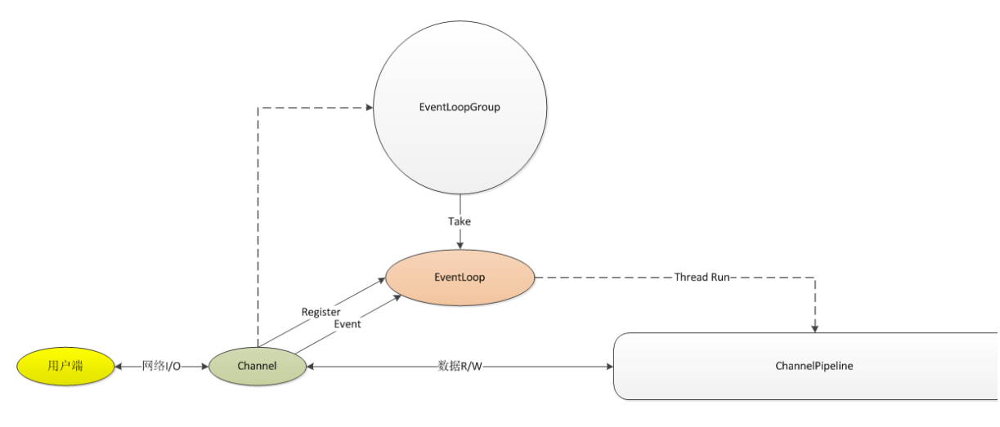
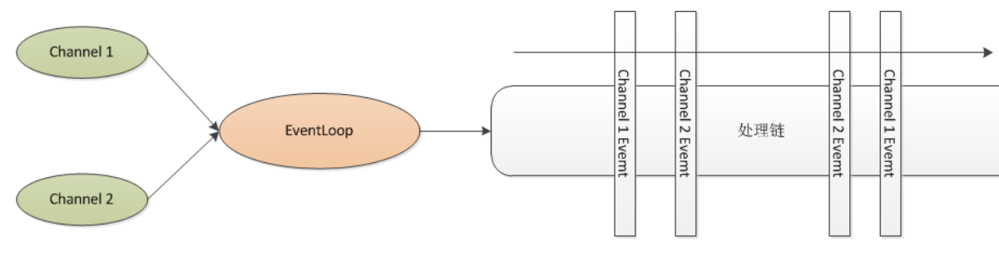
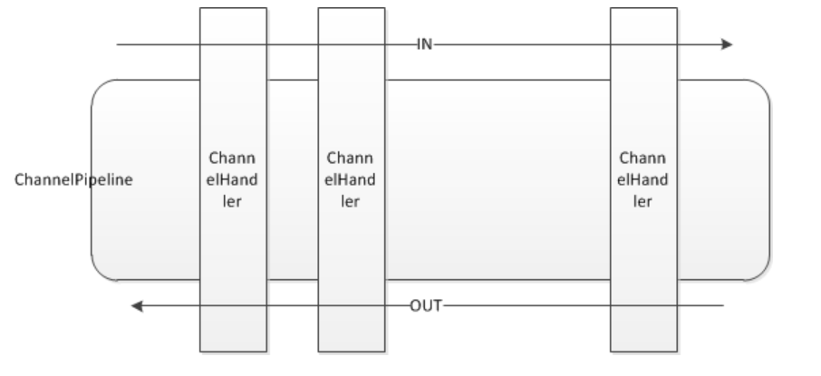
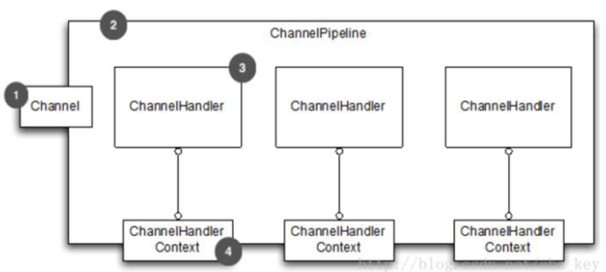
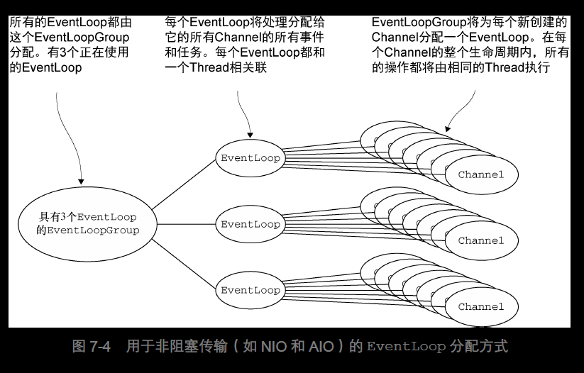

# netty笔记（siwang.hu&nbsp;&nbsp;V1.0）  
> + netty由JBOSS提供的一个Java开源框架  
>  
> + 提供异步的、事件驱动的网络应用程序框架和工具  
>  
> + 快速开发高性能、高可靠性的网络服务器和客户端程序  
>  
> + Netty是一个基于NIO的客户、服务器端编程框架  
>  
> + 提供了多种协议的编解码包括HTTP、二进制和Google Protobuf等等，它们通过Codec Framework进行整合  
>  
> + [demo例程](https://github.com/siwanghu/Netty)  
>  
> + [学习网站](https://waylau.com/netty-4-user-guide/Preface/The%20Problem.html)  
>  
## NIO  
> NIO 提供了一个所有I/O 操作的全异步的实现。它利用了自NIO 子系统被引入JDK 1.4 时便
可用的基于选择器的API。选择器背后的基本概念是充当一个注册表，在那里你将可以请求在Channel 的状态发生变化时得到通知。可能的状态变化有：  
> + 新的Channel 已被接受并且就绪OP_ACCEPT  
> + Channel 连接已经完成OP_CONNECT  
> + Channel 有已经就绪的可供读取的数据OP_READ  
> + Channel 可用于写数据OP_WRITE  
>  
>   
>  
## Channel  
>   
>  
> Channel是Netty的核心概念之一，它是Netty网络通信的主体，由它负责同对端进行网络通信、注册和数据操作等功能  
> + 一旦用户端连接成功，将新建一个channel同该用户端进行绑定  
>  
> + channel从EventLoopGroup获得一个EventLoop，并注册到该EventLoop，channel生命周期内都和该EventLoop在一起（注册时获得selectionKey）  
>  
> + channel同用户端进行网络连接、关闭和读写，生成相对应的event（改变selectinKey信息），触发eventloop调度线程进行执行  
>  
> + 如果是读事件，执行线程调度pipeline来处理用户业务逻辑  
>   
> 多个channel可以注册到一个eventloop上，所有的操作都是顺序执行的，eventloop会依据channel的事件调用channel的方法进行相关操作，每个channel的操作和处理在eventloop中都是顺序的  
>  
>   
>  
> ## ChannelPipeline和ChannelHandler  
> + ChannelPipeline和ChannelHandler用于channel事件的拦截和处理  
>  
> + Netty使用类似责任链的模式来设计ChannelPipeline和ChannelHandler  
>  
> + ChannelPipeline相当于ChannelHandler的容器，channel事件消息在ChannelPipeline中流动和传播，相应的事件能够被ChannelHandler拦截处理、传递、忽略或者终止  
>  
>   
>  
> + inbound:当发生某个I/O操作时由IO线程流向用户业务处理线程的事件，如链路建立、链路关闭或者读完成等  
> + outbound:由用户线程或者代码发起的IO操作事件  
> ## ChannelHandlerContext  
> + 每个ChannelHandler 被添加到ChannelPipeline 后，都会创建一个ChannelHandlerContext 并与之创建的ChannelHandler 关联绑定  
>  
> + ChannelHandler通过ChannelHandlerContext来操作channel和channelpipeline  
>  
>   
>   
> + ChannelHandler负责I/O事件或者I/O操作进行拦截和处理，用户可以通过ChannelHandlerAdapter来选择性的实现自己感兴趣的事件拦截和处理  
>  
> + 由于Channel只负责实际的I/O操作，因此数据的编解码和实际处理都需要通过ChannelHandler进行处理  
>  
> + [参考例程](https://blog.csdn.net/yinbucheng/article/details/77053692)  
>  
> + ChannelPipeline是线程安全的，多个业务线程可以并发的操作ChannelPipeline；ChannelHandler不是线程安全的，用户需要自己保重ChannelHandler的线程安全  
> ## ByteBuffer  
> + 在Netty中并没有使用Java自带的ByteBuffer,而是自己实现提供了一个缓存区来用于标识一个字节序列，并帮助用户操作原始字节或者自定义的POJO  
>  
> + channel与对端的I/O读写都要操作Buffers。当有读操作时，把数据从内核区读取到用户区，当有写操作时，把数据从用户区写到内核区  
>  
> + ByteBuf是Netty的实现的最基本的数据缓冲，它包括Heap Buffer和Direct Buffer  
>  
> + ByteBuf实现了高级的功能和API，是Java NIO ByteBuffer更高级的封装和实现  
> ## EventLoop和EventLoopGroup  
>   
>  
> + EventLoopGroup 负责为每个新创建的Channel 分配一个EventLoop。在当前实现中，
使用顺序循环（round-robin）的方式进行分配以获取一个均衡的分布，并且相同的EventLoop
可能会被分配给多个Channel  
>  
> + 一旦一个Channel 被分配给一个EventLoop，它将在它的整个生命周期中都使用这个
EventLoop（以及相关联的Thread）。请牢记这一点，因为它可以使你从担忧你的Channel-
Handler 实现中的线程安全和同步问题中解脱出来  
>  
> + 另外，需要注意的是，EventLoop 的分配方式对ThreadLocal 的使用的影响。因为一个
EventLoop 通常会被用于支撑多个Channel，所以对于所有相关联的Channel 来说，
ThreadLocal 都将是一样的。这使得它对于实现状态追踪等功能来说是个糟糕的选择。然而，
在一些无状态的上下文中，它仍然可以被用于在多个Channel 之间共享一些重度的或者代价昂
贵的对象，甚至是事件  
>  
> ## 业务代码  
> + 耗时的业务代码放入自定义线程池去执行  
>  
> + 业务代码里面调用write方法，netty会把你要写出去的消息放入他的对接，然后依靠调度将消息写出去，你只需要write  
>   
> + Netty其实是允许在非NIO线程中写消息的。如果当前是在NIO线程，就直接写过去，如果不在NIO线程，写消息操作会被封装成一个task，然后再由NIO线程池来处理  
```
private void write(Object msg, boolean flush, ChannelPromise promise) {
        AbstractChannelHandlerContext next = findContextOutbound();
        final Object m = pipeline.touch(msg, next);
        EventExecutor executor = next.executor();
        if (executor.inEventLoop()) {
            if (flush) {
                next.invokeWriteAndFlush(m, promise);
            } else {
                next.invokeWrite(m, promise);
            }
        } else {
            AbstractWriteTask task;
            if (flush) {
                task = WriteAndFlushTask.newInstance(next, m, promise);
            }  else {
                task = WriteTask.newInstance(next, m, promise);
            }
            safeExecute(executor, task, promise, m);
        }
    }
```  
> 
