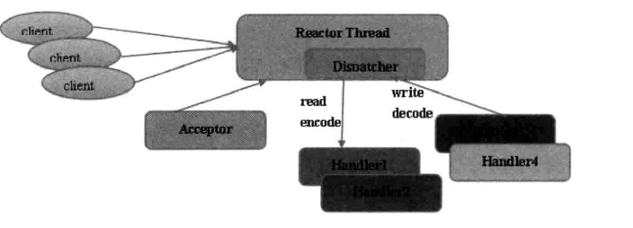
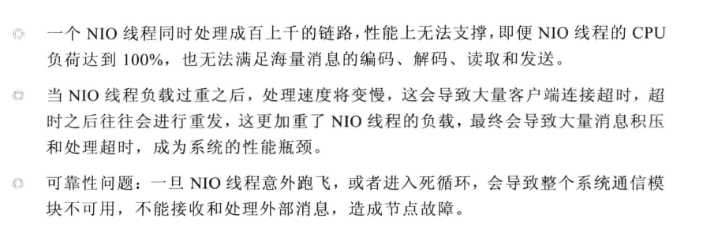
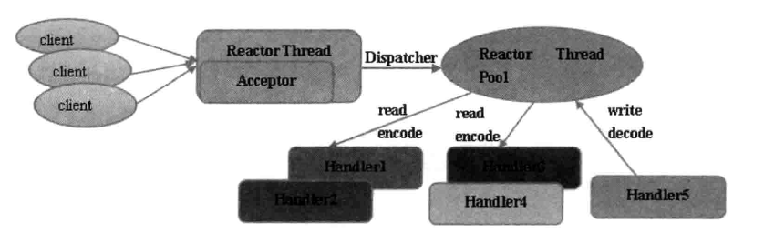
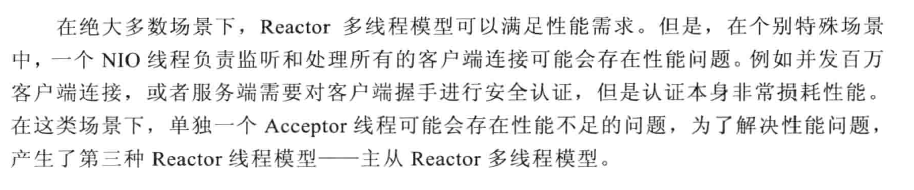
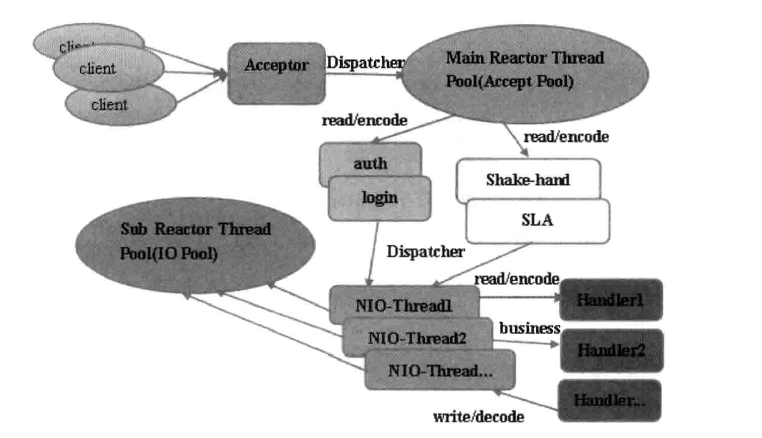
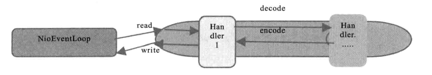
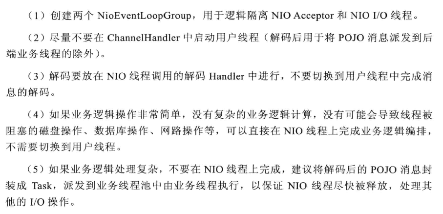

# netty线程模型（siwang.hu&nbsp;&nbsp;V1.0）  
> Reactor模型：异步非阻塞IO，所有的IO操作都不会导致阻塞
## Reactor单线程模型  
> Reactor单线程模型，指所有的I/O操作都在同一个NIO线程上面完成：  
>  
> 
> + 作为NIO服务端，接收客户端的TCP连接  
>  
> + 作为NIO客户端，向服务端发起TCP连接  
>  
> + 读取通信对端的请求或者应答数据  
>  
> + 向通信对端发送消息请求或者应答消息  
>  
> 在小容量应用场景下，可以使用单线程模型，但是对于高负载，大并发的应用场景却并不合适:  
>   
## Reactor多线程模型  
> Reactor多线程模型通过增加一组NIO线程来处理IO操作  
>  
>   
> + 专门的NIO线程（acceptor线程）用于监听服务端，接收客户端的TCP连接请求  
>  
> + 网络IO操作（读写等）由一个NIO线程池负责，线程池可以采用标准的JDK线程池实现，这些线程池负责消息的读取，解码和发送  
>  
> + 一个NIO线程可以同时处理多条链路，但一条链路只对应一个NIO线程,防止发生并发操作问题  
>  
>   
>  
## 主从Reactor多线程模型  
>   
>  
> 服务端用于接收客户端连接的不再是一个单独的NIO线程，而是一个独立的NIO线程池。Acceptor接收到客户端TCP连接请求后并处理完成（包含接入认证等），将新创建的SocketChannel注册到IO线程池的某个IO线程上，由它负责SocketChannel的读写和编解码工作  
## Netty线程模型  
> **Netty接收客户端请求线程池**  
> + 接收客户端TCP连接，初始化Channel参数  
> + 将链路状态变更事件通知给ChannelPipeline  
>  
> **Netty处理IO操作线程池**  
> + 异步读取通信对端的数据报，发送读事件到ChannelPipeline  
> + 异步发送消息到通信对端，调用ChannelPipeline的消息发送接口  
> + 执行系统调用Task，定时任务  
>  
> 通过调整线程池的线程个数，是否共享线程池等，Netty的Reactor线程模型可以在单线程，多线程和主从多线程间切换  
## Netty局部无锁优化  
> Netty在IO线程内部进行串行操作，避免多线程竞争导致的性能下降问题，通过调整NIO线程池的线程参数，可以同时启动多个串行化的线程并行运行，局部无锁化的设计模型在实际效果中表现最优：  
> **原理图:**  
>   
>  
>   
>   
> 线程配置计算公式:  
> + 一：线程数量=(线程总事件/瓶颈资源时间)*瓶颈资源的线程并行数  
>  
> + 二：QPS=1000/线程总时间*线程数(每秒查询率QPS)  
> *线程数量配置以实际效果位准*