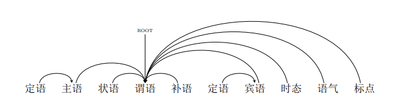
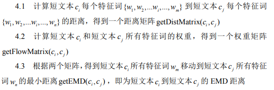

# 文本建模  
> **1.向量空间模型**  
> 向量空间模型(VSM)使用词袋模型(词袋模型基于一元文法统计模型)表示方法将词表示成one-hot向量，该模型假设文档之间是相互独立的，词语之间也是相互独立的将文本映射成高维的特征向量，利用特征空间向量来表示文本  
>  
> **2.浅层语义分析模型**  
>  浅层语义分析模型(LSA),构造一个文档与词语的关系矩阵，矩阵的行表示词语，矩阵的列则表示文档，矩阵中元素的值表示该词语出现在该文档中的次数，也可以使用词语在文档中的权重来给矩阵中的元素赋值。使用PCA降维对文档与词语的关系矩阵进行降维，使得文档中相似的词合并掉  
>  
> **3.文档主题模型**  
> 文档主题模型(LDA)从语义出发，在词语和文档的关系之外，引入了主题词的概念，增加了词语和主题词的关系，主题词和文档的关系。该模型要指定文档主题的数量，即文本语料中包含有多少个主题，通过对文本语料的训练，给出每个文本属于每个主题的概率，以及文本中的每个词语属于每个主题的概率。  
# 词频分析  
> **pip install nltk**  
> **pip install matplotlib**  
>('会议', 6182)  
>('电话', 4136)  
>('需求', 2488)  
>('视频会议', 2263)  
>('试用', 2176)  
>('购买', 2143)  
>('注册', 2117)  
>('收费', 1945)  
>('支持', 1882)  
>('联系', 1825)  
>('下载', 1812)  
>('系统', 1718)  
>('账号', 1678)  
>('软件', 1665)  
>('电话会议', 1609)  
>('参加', 1599)  
>('邮箱', 1585)  
>('手机', 1531)  
>('电脑', 1415)  
>('视频', 1378)  
>('测试', 1349)  
>('销售', 1187)  
>('接入', 1074)  
>('报价', 1021)  
>('呼叫', 995)  
>('咨询', 993)  
>('参会', 939)  
>('终端', 882)  
>('产品', 846)  
>('负责人', 834)  
>('网络', 822)  
>('申请', 796)  
>('帐号', 785)  
>('登录', 763)  
>('中心', 741)  
>('方', 738)  
>('链接', 728)  
>('网页', 713)  
>('人数', 695)  
>('操作', 690)  
>('问题', 690)  
>('密码', 690)  
>('会议室', 686)  
>('硬件', 644)  
>('官网', 589)  
>('行业', 560)  
>('免费', 560)  
>('买', 552)  
>('功能', 551)  
>('点击', 540)  
>  
>   
> 
# Word2Vec词向量训练  
>  **pip install gensim**  
> 构建三层神经网络，分别是输入层，隐藏层,softmax输出层。对词进行one-hot编码，输入网络训练，词向量训练结果为词one-hot向量与网络隐藏层中间权重矩阵相乘  
> **1.skip-gram算法**  
>   
>  
> **2.CBOW算法**  
>   
> **"产品"的相似词**(1,300)向量  
>   
>平台 0.7766879796981812  
>业务 0.7454820275306702  
>解决方案 0.7286168336868286  
>服务 0.7222141027450562  
>软件 0.7052211761474609  
>方案 0.6947022676467896  
>系统 0.6891728639602661  
>功能 0.6855509281158447  
>智能 0.6630642414093018  
>代理 0.6596889495849609  
# 高频词聚类(意图分析)
> **pip install sckit-learn**    
> **k-means聚类算法**    
>第1类：  ['手机', '电脑', '网页']  
>第2类：  ['买', '购买']  
>第3类：  ['邮箱']  
>第4类：  ['会议']  
>第5类：  ['免费', '问题']  
>第6类：  ['中心', '电话会议', '硬件', '视频会议']  
>第7类：  ['需求']  
>第8类：  ['负责人', '销售']  
>第9类：  ['官网', '密码', '点击', '登录', '链接']  
>第10类：  ['人数']  
>第11类：  ['电话']  
>第12类：  ['产品', '功能', '支持', '系统', '网络', '视频', '软件']   
>第13类：  ['联系']  
>第14类：  ['下载', '操作']  
>第15类：  ['帐号', '账号']  
>第16类：  ['测试', '试用']  
>第17类：  ['接入', '终端']  
>第18类：  ['行业']  
>第19类：  ['注册', '申请']  
>第20类：  ['收费']  
>第21类：  ['参加']  
>第22类：  ['报价']  
>第23类：  ['会议室', '参会', '方']  
>第24类：  ['呼叫']  
>第25类：  ['咨询']  
# 关联分析  
> **pip install apyori**  
> 关联分析发现隐藏在大型数据集中有意义的数据联系的方法  
>    
> 关联规则是形如X→Y的表达式，其中X和Y是不相交的项集，即X∩Y=∅。关联规则的强度可以用支持度和置信度衡量。支持度确定规则可以用于给定数据集的频繁程度，而置信度确定Y在包含X的事务中出现的频繁程度。支持度(s)和置信度(c)的形式定义如下：  
>   
>   
> **Apriori算法**&nbsp;&nbsp; [FP增长算法](https://blog.csdn.net/qq_23100787/article/details/51790637)  
> [参考资料](http://crescentmoon.info/2013/02/18/%E3%80%8A%E6%95%B0%E6%8D%AE%E6%8C%96%E6%8E%98%E5%AF%BC%E8%AE%BA%E3%80%8B%E6%80%BB%E7%BB%93%E4%B9%8B%E5%85%B3%E8%81%94%E5%88%86%E6%9E%90/)  
# 关键词提取  
> **pip install jieba**
>## **TF-IDF**算法
> **关键字的提取严重依赖预料库**  
> TF=(词在文档中出现的次数)/(文档总词数)  
> IDF=log(语料库中文档总数/(包含该词的文档数+1))  
> TF-IDF= TF*IDF  
> TF-IDF值越大，则这个词成为一个关键词的概率就越大  
> ## **TextRank**算法  
> 1.先对文档分词,分词结束词性标注处理，并过滤掉一些停用词，保留我们需要的词性的单词，名词或者动词或形容词  
>  
> 2.将上述我们需要的词语构建一个关键词图，其中词语为图的节点，然后通过共现关系构造任意两点之间的边，两个节点之间存在边仅当他们对应的词汇在长度为k的窗口中共现，K表示窗口的大小，即一个窗口单词的个数默认是5  
>  
> 3.根据PageRank原理中的衡量重要性的公式，初始化各节点的权重，然后迭代计算各节点的权重，直至收敛
>   
> 4.对节点权重进行排序，选取得分最高的几个作为候选关键词
# 依存文法分析  
> 1.一个句子中只有一个成分是独立的  
>  
> 2.其它成分直接依存于某一成分  
>  
> 3.任何一个成分都不能依存与两个或两个以上的成分  
>  
> 4.如果A成分直接依存于B成分，而C成分在句中位于A和B之间，那么C或者直接依存于B，或者直接依存于A和B之间的某一成分  
>  
> 5.中心成分左右两面的其它成分相互不发生关系  
>  
>## 举例
>  主谓关系&nbsp;&nbsp;SBV&nbsp;(subject-verb)&nbsp;&nbsp;我送她一束花 (我 <-- 送)  
>  
>  动宾关系&nbsp;&nbsp;VOB&nbsp;(verb-object)&nbsp;&nbsp;我送她一束花 (送 --> 花)  
>  
>  间宾关系&nbsp;&nbsp;IOB&nbsp;(indirect-object)&nbsp;&nbsp;我送她一束花 (送 --> 她)  
>  
> 前置宾语&nbsp;&nbsp;FOB&nbsp;(fronting-object)&nbsp;&nbsp;他什么书都读 (书 <-- 读)  
>  
>  并列关系&nbsp;&nbsp;COO&nbsp;(coordinate)&nbsp;&nbsp;大山和大海 (大山 --> 大海)  
>  
>  定中关系&nbsp;&nbsp;ATT&nbsp;(attribute)&nbsp;&nbsp;红苹果 (红 <-- 苹果)  
>  
> 兼语&nbsp;&nbsp;DBL&nbsp;(double)&nbsp;&nbsp;他请我吃饭 (请 --> 我)  
> ## 句子结构  
> **现代汉语结构：** &nbsp;(定语)主语 + [状语]谓语 <补语> + (定语)宾语  
> 
# 句子相似度计算  
> ## 1.句向量  
> 1.对句子中的所有词的词向量进行加权平均(每个词向量的权重为**a/(a+p(w))**  
> **a** 代表参数，**p(w)** 代表词w的频率(相对整个预料的频率，不是指相对句子的频率)  
>  
> 2.使用[PCA算法](https://github.com/siwanghu/Machine-Learning/blob/master/%E4%B8%BB%E6%88%90%E5%88%86%E5%88%86%E6%9E%90.pdf)对生成的句向量降维  
>   
> 参考论文[A Simple but Tough-to-Beat Baseline for Sentence Embeddings](https://openreview.net/pdf?id=SyK00v5xx)  
> ## 2.EMD距离  
> **pip install pyemd**  
> 首先将参与计算相似度的句子进行分词，去除停用词。接着查找词的词向量并计算每个词在所在句子中的词频。采用EMD距离计算短文本间的语义相似度，将一个句子的特征词向量全部“流向”另一个句子的特征词向量所经过的距离总和的最小值作为两个短文本之间的语义相似度。  
>    
>   
>  
> [pyemd参考资料](https://github.com/wmayner/pyemd)&nbsp;&nbsp;&nbsp;&nbsp;[EMD介绍](https://blog.csdn.net/index20001/article/details/77162495)  
>  
# 闲聊设计    
> **1.使用seq2seq2模型，在tensorflow上实现**  
> **pip install tensorflow-gpu**  
> [实现代码](https://github.com/siwanghu/chabot/blob/master/train.py)&nbsp;&nbsp;&nbsp;&nbsp;&nbsp;[注意力机制](https://blog.csdn.net/malefactor/article/details/78767781)  
>  
>   
>  
> **2.图灵机器人**  
> **pip install itchat**  
> [实现代码](https://github.com/siwanghu/chabot/blob/master/wechat.py)  
# Elasticsearch  
> **pip install elasticsearch**  
> 基于Lucene的全文搜索引擎  
> [入门教程](http://www.ruanyifeng.com/blog/2017/08/elasticsearch.html)&nbsp;&nbsp;[官方教程](https://www.elastic.co/guide/en/elasticsearch/reference/current/getting-started.html)  
# 文本聚类  
> ## 1.产品  
> 第1类：  ['请问你们的云视频会议产品可以作二次开发吗', '请问你们的产品是否提供开放式']  
> 第2类：  ['产品大概多少钱啊', '什么样的产品']  
> 第3类：  ['上次有找你们了解过你们的产品', '不了解你们的产品']  
> 第4类：  ['之前没有用过你们家产品', '产品可以发过来体验']  
> 第5类：  ['产品试用的人数有限制嘛', '你们产品如何试用']  
> 第6类：  ['您是需要什么产品吗', '请问我需要产品的价格的话']  
> 第7类：  ['你们公司的产品是做视频直播的', '公司已经估使用你们的产品了']  
> 第8类：  ['个人能够购买你们的产品吗', '产品在线购买是怎么操作']  
> 第9类：  ['如果作为加入会议的一方还需要购买咱们的产品吗', '如果是发起会议就必须付费购买产品吧']  
> 第10类：  ['你们的产品网络视频会议系统', '你们的网络直播产品']  
> 第11类：  ['产品使用', '你们的产品怎么使用啊']  
> 第12类：  ['产品的收费标准我看一下', '你们产品的收费是怎样的']  
> 第13类：  ['刚有留联系方式咨询产品的', '咨询一下你们外呼的产品']  
> 第14类：  ['你们的产品是会议还是呼叫中心', '关于呼叫中心的产品白皮书']  
> 第15类：  ['介绍下你们产品呗', '介绍下您家的产品']  
> 第16类：  ['不能先给我个你们的产品介绍或方案么', '产品介绍可以发给我看一下吗']  
> 第17类：  ['你们的产品可以满足这个需求吗', '刚才你们同事打电话咨询我的产品需求']  
> 第18类：  ['你们这个产品是可以直接拨打其他人手机号加入电话会议的吗', '我想问下你们这个产品是以网页的形式进行在线视频会议的吗']  
> 第19类：  ['另外用你们的产品是需要下载软件的吗', '就其他人不用下载你们的产品']  
> 第20类：  ['你们卖的产品是软件吗', '你们的产品是硬件还是软件啊']  
> 第21类：  ['你们的产品可以满足这些要求么', '你们的产品能满足这些功能吗']  
> 第22类：  ['产品信息的收费情况', '产品属于什么的']   
> 第23类：  ['想了解一下咱们产品都在什么单位使用呢', '想了解一下咱们的产品功能']  
> 第24类：  ['会议产品费用如何', '会议终端如果本身就是思科的产品']  
> 第25类：  ['产品主要功能', '产品功能']  
> 第26类：  ['能安排一下产品经理和我联系吗', '要不我就联系别的产品了']  
> 第27类：  ['你们代理思科的产品吗', '你们是代理的思科的产品吗']  
> 第28类：  ['产品功能和报价', '产品和报价']  
> 第29类：  ['产品确定了', '我不太清楚你们的产品']  
> 第30类：  ['不知道咱们的产品是否支持', '产品支持多人在线视频']  
> ## 2.硬件  
> 第1类：  ['不需要买硬件对吧', '不需要任何硬件', '不需要其他硬件了吧']  
> 第2类：  ['不是硬件', '不是硬件', '主要是硬件']  
> 第3类：  ['但是我们想要带硬件的那种', '你们是做软件还是硬件还是软件硬件一起做全套的', '你们是用硬件实现视频会议还是纯软件']  
> 第4类：  ['不用购买硬件', '不购买额外的硬件', '不需要另外购买硬件支持的']  
> 第5类：  ['你们也提供硬件吧', '你们公司做视频会议硬件吗', '你们提供的是否包括硬件设备']  
> 第6类：  ['你们这个是没有硬件的是吧', '如果没有硬件', '您这边没有硬件设备']  
> 第7类：  ['你们的硬件终端包括哪些设备', '宝利通的硬件终端可以通吗', '我们还有思科硬件终端']  
> 第8类：  ['一般视频会议需要些什么硬件设备', '不需要硬件支持吗', '会议室需要什么硬件支持呢']  
> 第9类：  ['一年包含硬件吗', '不用其他硬件', '不用其他硬件吗']  
> 第10类：  ['后期会有硬件视频会议需求', '对硬件有什么需求吗', '或者对硬件有什么需求你们也可以给我们方案']  
# 方案设计  
> **设计图**  
>  
>   
> **方案步骤**  
> 1.原始数据-->数据分词-->语料IDF计算 **(计算原始语料数据词语IDF值)**  
>  
> 2.原始数据-->数据分词-->Word2Vec词向量训练 **(训练词向量)**  
>  
> 3.Word2Vec词向量训练-->同义词分析 **(分析高频词同义词)**  
>  
> 4.原始数据-->数据分词-->词频统计-->高频词聚类-->问题提取-->意图分类 **(意图提取)**  
>  
> 5.意图分类-->TF-IDF关键词提取-->语义向量构建-->文本聚类-->问题分类 **(问题细分)**  
>  
> **第4步：先按照提取问题中含有的关键字优先级 *(以词频表示优先级)* 对问题做出意图分类**  
> **第5步：对第4步中分类的每个意图分别采取文本聚类 *(语义向量构建)* 进一步对意图分类**  
# 项目构建  
> **python项目构建**  
>  
> [参考资料](https://www.jianshu.com/p/81d20ccf5d13)&nbsp;&nbsp;&nbsp;&nbsp;[构建工具](http://beginman.cn/python/2016/01/18/python-tools-dev/)  
>  
