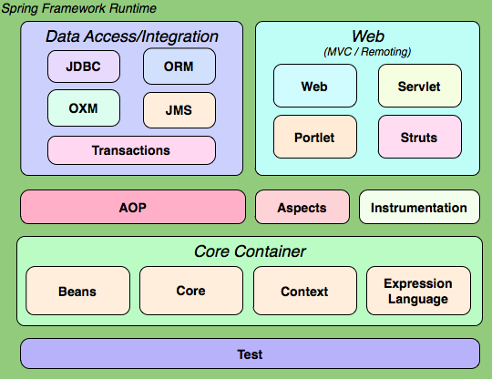

# Spring概述笔记（siwang.hu&nbsp;&nbsp;V1.0)  
> + Spring是企业级Java应用程序开发中最受欢迎的开发框架  
>  
> + Spring是一个开源的Java平台  
>  
> + Spring最核心的两个技术思想是：IoC 和 Aop  
>  
## Ioc  
> + IoC（Inversion of Control） ，意为控制反转  
>  
> + Spring 最认同的技术是控制反转的依赖注入（DI）模式,依赖注入是控制反转具体实现  
>  
> + 在编写每一个Java类时，我们应该尽可能的独立于其他的Java类，减少对其它类的依赖性来增加这些类的可重用性  
>  
> + 依赖注入有助于将这些类粘合在一起，使他们保持独立  
>  
> + 例如类A的工作依赖于类B，通过依赖注入将类B注入到类A中  
>  
## Aop  
> + Aop（面向切面的程序设计思想）  
>  
> + 一个程序中跨越多个点的功能被称为横切关注点，这些横切关注点在概念上独立于应用程序的业务逻辑(日志记录、声明性事务、安全性，和缓存)  
>  
> + AOP 帮助你将横切关注点从它们所影响的对象中分离出来，然而依赖注入帮助你将你的应用程序对象从彼此中分离出来  
>  
> + Spring框架的AOP模块提供了面向切面的程序设计实现，允许你定义拦截器方法和切入点，可以实现将应该被分开的代码干净的分开功能  
> 
## 体系结构  
>   
>  
> + Core Container，spring容器使用依赖注入管理构成应用的组件，它会创建相互协作的组件之间的关联  
>  
> + AOP and Instrumentation提供了对面向切面编程的丰富支持  
>  
> + Web 提供了基本的面向web的功能,包括MVC和REST web服务实现  
>  
> + Test 以Junit和TestNG来支持spring组件的单元测试和集成测试  
>  
> + Data Access/Integaration 包含了JDBC / ORM / OXM / JMS和Transaction模块  
> 