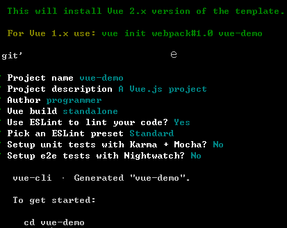

# vue开发环境搭建笔记（siwang.hu&nbsp;&nbsp;V1.0）  
> Vue.js是一套构建用户界面的 “渐进式框架”，核心库只关注视图层,提供试图与数据的双向绑定  
## 安装node.js  
> + node.js官方[下载地址](https://nodejs.org/en/download/)  
>  
> + 安装操作系统对应版本的node.js  
>  
> + 安装过程中如果出现添加环境变量选项必须选上  
>  
> + 安装结束控制台输入**node**或**npm**命令，命令执行成功表示node安装成功  
## 安装cnpm  
> 由于npm下载包非常的忙，安装国内代理cnpm工具  
> + 安装命令为：**npm install -g cnpm --registry=https://registry.npm.taobao.org**  
>  
> + 以后需要使用npm命令的地方可以替换为cnpm命令  
## 安装vue-cli  
> vue-cli是vue官方提供的一个命令行工具，可用于快速搭建大型单页应用。该工具提供开箱即用的构建工具配置，带来现代化的前端开发流程  
> + 安装命令为：**cnpm install -g vue-cli**  
>  
> + 检查是否安装成功可以在控制台输入vue，命令执行成功表示node安装成功  
## 新建Vue项目  
> + **vue init webpack vue-demo**&nbsp;&nbsp;(vue-demo为项目名字)  
>  
> + 按照脚手架工具配置项目信息  
>   
>  
> + 进入项目根目录执行**cnpm install**命令,安装项目依赖的包,安装完成之后，项目目录下多出node_modules文件夹  
>  
> + 根目录执行**cnpm run dev**命令，运行项目
## iView介绍  
> + iView[官网](https://www.iviewui.com/)，iView组件是一套基于vue的前端组件库，可以帮助前端工作者快速开发美观的前端界面
>  
> + iView提供完整的教程，上手简单快速  
>  
## 在项目中引入iView  
> + 在main.js中添加  
```
import iView from 'iview'
import 'iview/dist/styles/iview.css'    // 使用 CSS
Vue.use(iView)
```
> + 完整main.js文件  
```
import Vue from 'vue'
import App from './App'
import router from './router'
import iView from 'iview'
import 'iview/dist/styles/iview.css'    // 使用 CSS

Vue.config.productionTip = false
Vue.use(iView)
/* eslint-disable no-new */
new Vue({
  el: '#app',
  router,
  template: '<App/>',
  components: { App }
})
```
> + 安装iView，**cnpm install --save iview**  
## Vue中引入axios  
> + axios是一个基于promise的HTTP库，可以用在前端和后台中获取数据  
>  
> + 安装命令**cnpm install axios**  
>  
> + 组件局部引入  
```
import axios from 'axios'
```
> + 全局引入,在main.js中添加,在各个组件中this.$axios.get()使用  
```
import axios from 'axios'
Vue.prototype.$axios = axios;
```
> + axios使用demo,*采用在main.js中全局引入*  
```
this.$axios.get("/asr/asrText", {
    params: {
        deviceIdAndSessionId:_self.deviceId+":"+_self.sessionId,
    }}).then(result => {
          console.log(result);
          console.log("长度"+result.data.length);
          console.log("刷新一次");
          this.asrText=result.data;
    }).catch(err => {});
```