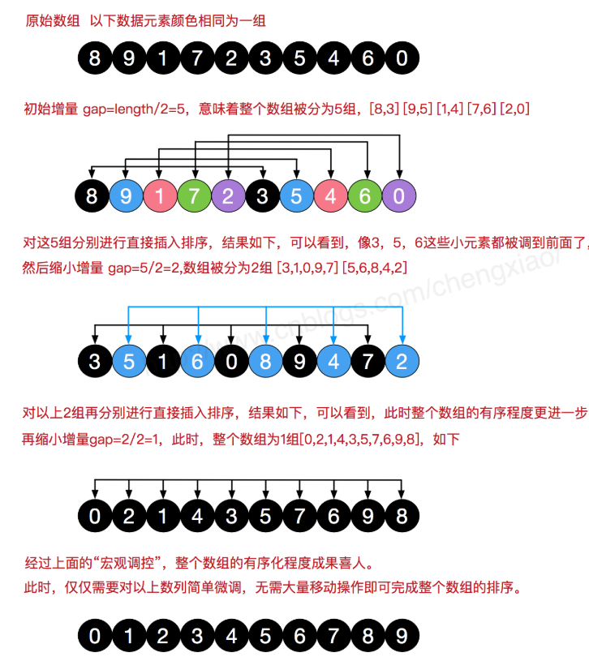
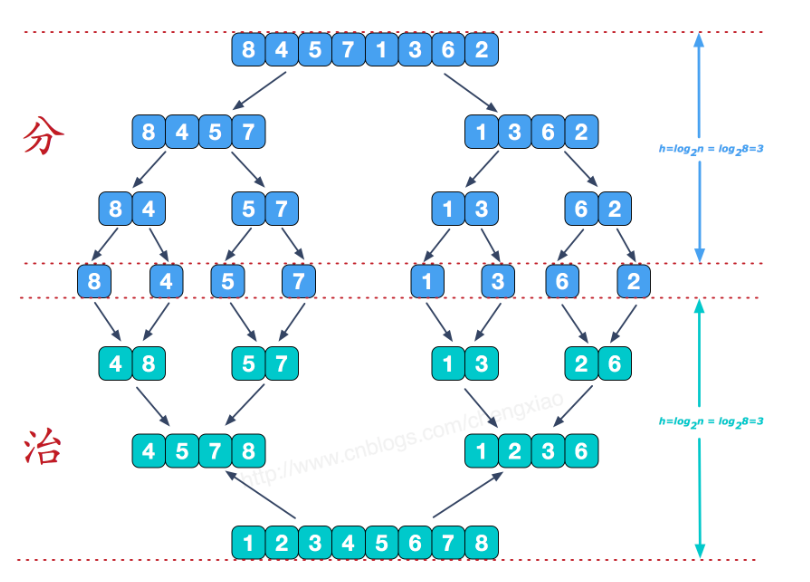
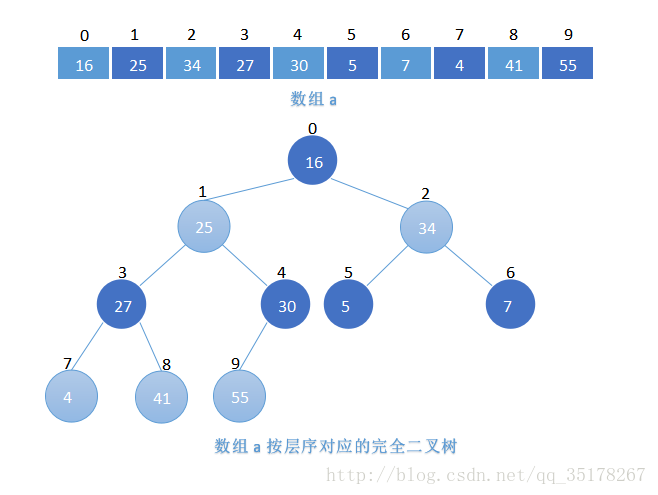
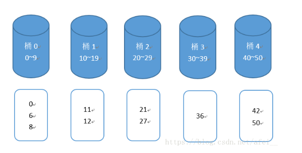
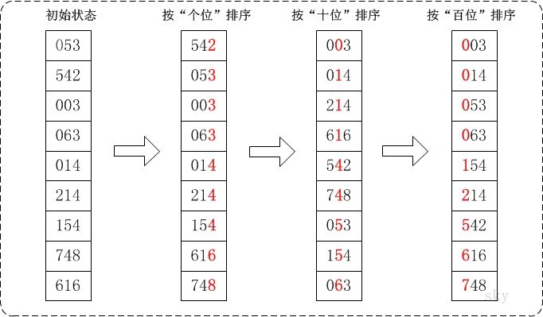

# 基本排序算法总结（siwang.hu&nbsp;&nbsp;V1.0）  
> + 内部排序是数据记录在内存中进行排序，排序过程中不需要访问外存  
>  
> + 外部排序是数据量巨大，内存一次无法容纳所有的数据，排序过程中需要访问外存  
>  
>   
>  
> **排序算法的稳定性是指排序前后若存在相同关键字的元素之间相对次序没有改变，则这个排序算法就是稳定的；否则，这个排序算法就是不稳定的**  
>  
## 冒泡排序  
> + 比较相邻的元素，如果第一个比第二个大，就交换相邻两个元素  
>  
> + 对每一对相邻元素做此步骤，直到最后一对相邻元素，一轮之后，最大的元素交换到最后  
>  
> + 以同样的方法重复上述两步（除了上轮最后一个元素不参与下一轮）  
>  
> **example**  
```
public void bubbleSort(int[] array){
    for(int i=0;i<array.length;i++){
        for(int j=1;j<array.length-i;j++){
            if(array[j-1]>array[j]){
                int temp=array[j];
                array[j]=array[j-1];
                array[j-1]=temp;
            }
        }
    }
}
```
## 选择排序  
> + 在未排序的序列中找到最小值，存放在排序序列起始位置  
>  
> + 从剩余为排序序列中找到最小值，添加到以排序序列后面  
>  
> + 重复以上，直到没有剩余未排序序列为止  
>  
> **example**  
```
public void selectSort(int[] array){
    for(int i=0;i<array.length;i++){
        for(int j=i;j<array.length;j++){
            if(array[i]>array[j]){
                int temp=array[j];
                array[j]=array[i];
                array[i]=temp;
            }
        }
    }
}
```
## 插入排序  
> + 将无序序列中的第一个元素看成有序序列  
>  
> + 将有序序列后面的无序序列的每个元素插入到前面有序序列的合适位置  
>  
> + 重复上一步，直到将无序序列中的元素都插入到前面有序序列中的合适位置  
>  
> + 插入排序有移位法与交换法，这里我们采用交换法实现  
>  
> **example**  
```
public void insertSort(int[] array){
    for(int i=0;i<array.length;i++){
        for(int j=i;j>0;j--){    
            if(array[j]<array[j-1]){     //交换法实现
                int temp=array[j];
                array[j]=array[j-1];
                array[j-1]=temp;
            }
        }
    }
}
```
## 希尔排序  
> + 选择一个增量序列t1，t2,...,tk，其中 ti > tj, tk = 1  
>  
> + 增量的选择是随意的，只要最后一个增量为1即可  
>  
> + 每趟排序，根据对应的增量ti，将待排序列分割成若干长度为m的子序列,分别对各子表进行直接插入排序。仅增量因子为 1 时，整个序列作为一个表来处理，表长度即为整个序列的长度  
>  
>   
>  
> **example**  
```
public void shellSort(int[] array){
    for(int grap=array.length/2;grap>0;grap/=2){
        for(int i=0;i<array.length;i+=grap){
            for(int j=i;j>0;j-=grap){
                if(array[j]<array[j-grap]){
                    int temp=array[j-grap];
                    array[j-grap]=array[j];
                    array[j]=temp;
                }
            }
        }
    }
}
```
## 归并排序  
> + 在排序前，建好一个长度等于原数组长度的临时数组，避免递归中频繁开辟空间  
>  
> + 设定两个指针，最初位置分别为两个已经排序序列的起始位置  
>  
> + 比较两个指针所指向的元素，选择相对小的元素放入到临时数组，并移动指针到下一位置  
>  
> + 直到某一指针达到序列尾，将另一序列剩下的所有元素直接复制到合并序列尾  
>  
> + 递归执行序列合并操作  
>  
>   
>  
> **example**  
```
private void merge(int[] array,int left,int mid,int right,int[] result){
    int i=left,j=mid+1,k=0;
    while(i<=mid && j<=right){
        if(array[i]<array[j]){
            result[k++]=array[i++];
        }else{
            result[k++]=array[j++];
        }
    }
    while(i<=mid){
        result[k++]=array[i++];
    }
    while (j<=right){
        result[k++]=array[j++];
    }
    k = 0;
    while(left <= right){
        array[left++] = result[k++];
    }
}

public void mergeSort(int[] array,int left,int right,int[] result){
    if(left<right){
        int mid=(left+right)/2;
        mergeSort(array,left,mid,result);
        mergeSort(array,mid+1,right,result);
        merge(array,left,mid,right,result);
    }
}
```
## 快速排序  
> + 从序列中挑出一个元素，称为基准元素(一般我们挑选第一个元素)  
>  
> + 将序列中所有元素比基准值小的摆放在基准前面，所有元素比基准值大的摆在基准的后面，使得基准处于数列的中间位置。这个称为partition操作  
>  
> + 递归地partition操作小于基准值元素的子数列和大于基准值元素的子数列  
>  
> **example**  
```
private int partition(int[] array,int left,int right){
    int pivot = left;
    int index = left + 1;
    for(int i=left;i<=right;i++){
        if(array[pivot]>array[i]){
            int temp=array[i];
            array[i]=array[index];
            array[index]=temp;
            index++;
        }
    }
    int temp=array[index-1];
    array[index-1]=array[pivot];
    array[pivot]=temp;
    return index-1;
}

public void quickSort(int[] array,int left,int right){
    if(left<right){
        int index=partition(array,left,right);
        quickSort(array,left,index-1);
        quickSort(array,index+1,right);
    }
}
```
## 堆排序  
>   
>  
> + 创建一个大顶堆 H[0......n-1]  
>  
> + 将堆顶元素与最后一个元素互换，把堆的大小缩小1，并将剩余元素重新调整为大顶堆  
>  
> + 重复以上，直到堆的尺寸为1  
>  
> **example**  
```
private void adjustHeap(int[] array,int size){
    for(int node=size/2;node>-1;node--) {
        int left = 2 * node + 1, right = 2 * node + 2;
        if (left <= size && array[left] > array[node]) {
            int temp = array[node];
            array[node] = array[left];
            array[left] = temp;
        }
        if (right <= size && array[right] > array[node]) {
            int temp = array[node];
            array[node] = array[right];
            array[right] = temp;
        }
    }
}

public void heapSort(int[] array){
    for(int i=array.length-1;i>0;i--){
        adjustHeap(array,i);
        int temp=array[i];
        array[i]=array[0];
        array[0]=temp;
    }
}
```
## 计数排序  
> + 扫描待排序数组A，获取最大值max  
>  
> + 创建新数组B，长度为(max + 1)  
>  
> + 数组B中下标为index中记录的值是A中index元素出现的次数  
>  
> + 最后遍历数组B，按照记录的次数输出相应的元素(也就是此时B的下标)  
>  
> **example**  
```
public void countSort(int[] array){
    int max=array[0];
    for(int i=0;i<array.length;i++){
        if(array[i]>max){
            max=array[i];
        }
    }
    int[] bucket=new int[max+1];
    for(int i=0;i<array.length;i++){
        bucket[array[i]]++;
    }
    int index=0;
    for(int i=0;i<bucket.length;i++){
        while(bucket[i]>0){
            array[index]=i;
            index++;
            bucket[i]--;
        }
    }
}
```
## 桶排序  
> + 设置固定数量的空桶，每个桶存储一定范围内的数据  
>  
> + 把数据放到对应的桶中，对每个不为空的桶中数据进行排序  
>  
> + 拼接不为空的桶中数据，得到最终排序结果  
>  
> + 对桶中可以采用O(n^2)的时间复杂度排序手法 
> 
> + 桶排序采用分块排序的手法，可以数学证明它的时间复杂度为O(n)  
>  
>  
## 基数排序  
> + 将所有待比较数值（正整数）统一为同样的数位长度，数位较短的数前面补零  
>  
> + 从最低位开始，依次进行一次排序  
>  
> + 从最低位排序一直到最高位排序完成以后, 数列就变成一个有序序列  
>  
>   