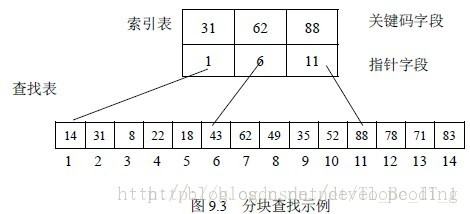

# 常用查找算法总结（siwang.hu&nbsp;&nbsp;V1.0）  
> 通过给定一个关键词，查找指定数据集中等于给定值的记录或数据元素  
## 线性表  
> 线性表是数据结构的一种，一个线性表是n个具有相同特性的数据元素的有限序列
### 顺序查找  
> + 从线性表的一端开始顺序扫描，依次将扫描到的关键字与给定值key相比较，若相等则表示查找成功  
>  
> + 若扫描结束仍没有找到关键字等于key的结点，表示查找失败  
>  
> **example**  
```
public int find(int[] array,int key){
    for(int i=0;i<array.length;i++){
        if(array[i]==key){
            return i;
        }
    }
    return -1;
}
```
### 二分查找  
> + 二分查找又称折半查找，是效率比较高的查找  
>  
> + 线性表必须是有序的顺序存储结构表（链表不可以）  
>  
> + 将表中间位置记录的关键字与查找关键字比较，如果两者相等，则查找成功  
>  
> + 否则利用中间位置记录将表分成前、后两个子表，如果中间位置的关键字大于查找关键字，则查找前一子表，否则查找后一子表  
>  
> + 重复以上过程，直到找到满足条件的记录，使查找成功；或直到子表不存在为止，此时查找不成功  
>  
> **example**  
```
public int binaryFind(int[] array,int key){
    int low=0,high=array.length-1,mid;
    while(low<=high){
        mid=(low+high)/2;
        if(array[mid]==key){
            return mid;
        }else if(array[mid]>key){
            high=mid-1;
        }else {
            low=mid+1;
        }
    }
    return -1;
}
```
### 分块查找  
> + 分块查找(Blocking Search)又称索引顺序查找  
>  
> + 分块查找由于只要求索引表是有序的，对块内节点没有排序要求，因此特别适合于**节点动态变化的情况**  
>  
> + 分块查找表是分块有序的，我们可以通过索引表来锁定关键字所在的区间，查找索引可以使用顺序查找或二分查找  
>  
> + 因为块中不一定是有序的，所以只能使用顺序查找  
>  
>   
> 