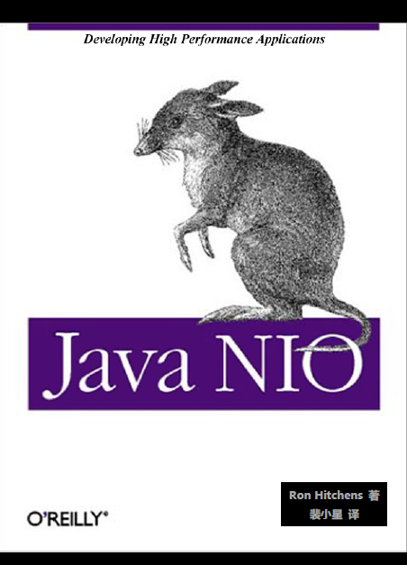
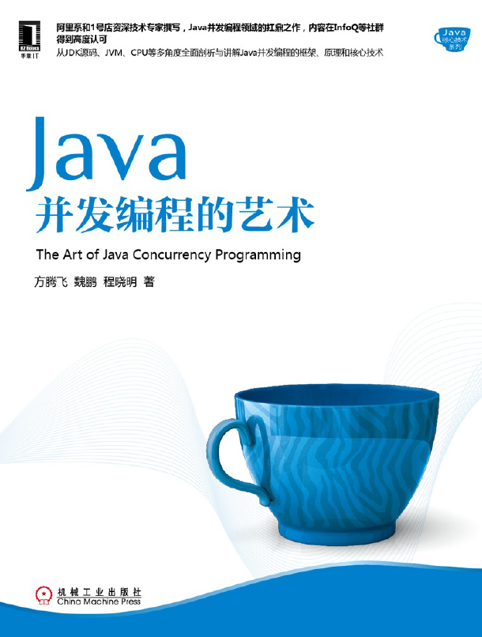
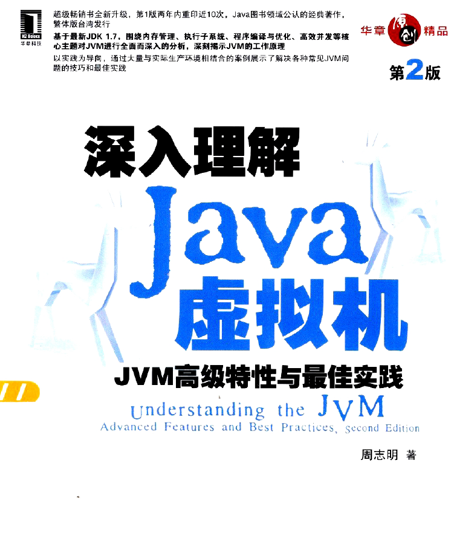
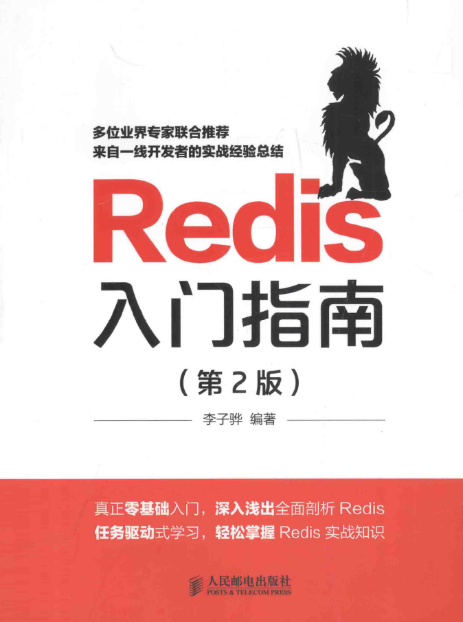
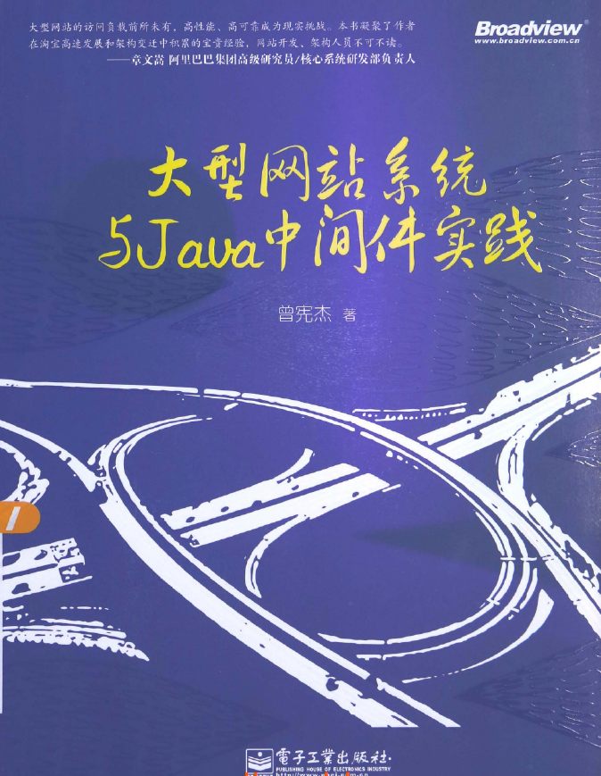
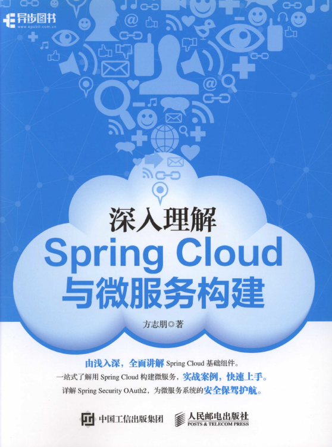
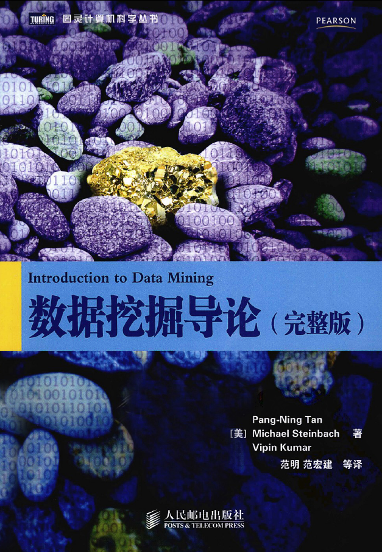
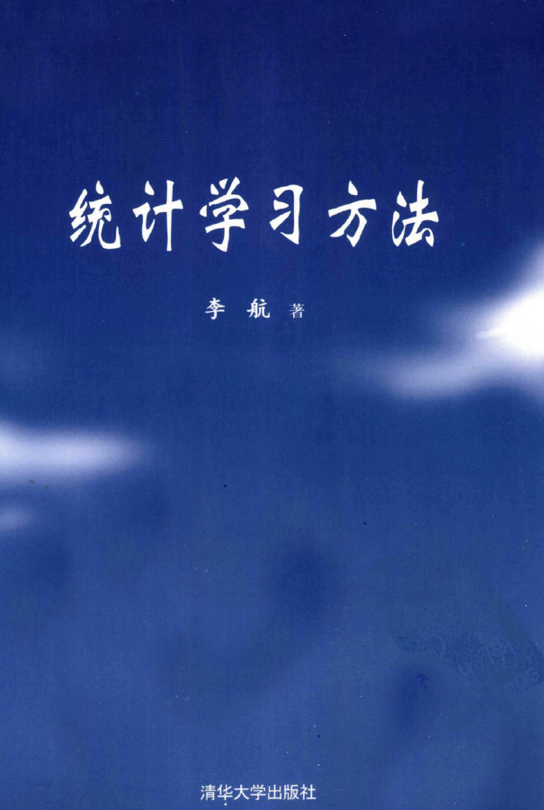

# 看过认为好的书笔记（siwang.hu&nbsp;&nbsp;V1.0）  
## 1.JavaNIO  
>   
> + 图书&nbsp;&nbsp;[下载链接](https://pan.baidu.com/s/1ZxON-I1fP5AsD3pdcikSiw)  
>   
## 2.Java并发编程的艺术  
>   
> + 图书&nbsp;&nbsp;[下载链接](https://pan.baidu.com/s/11j5bFRRH1NRD6BgVWcH5-Q)  
>  
## 3.深入理解Java虚拟机 JVM高级特性与最佳实践  
>   
> + 图书&nbsp;&nbsp;[下载链接](https://pan.baidu.com/s/1HVjYhKZ_-YOpK6iUqkEpsQ)  
>  
## 4.Redis入门指南  
>   
> + 图书&nbsp;&nbsp;[下载链接](https://pan.baidu.com/s/1Z86G5EnFObCfyCxF_MhsCQ)  
>  
## 5.Netty实战  
>   
> + 图书&nbsp;&nbsp;[下载链接](https://pan.baidu.com/s/1URcnizy4H0LXLNFj-LG4zg)  
>  
## 6.大型网站系统与Java中间件实践  
>   
> + 图书&nbsp;&nbsp;[下载链接](https://pan.baidu.com/s/1DMohm8pOlycaLw6jxZWXQw)  
>  
## 7.深入理解Spring Cloud与微服务构建  
>   
> + 图书&nbsp;&nbsp;[下载链接](https://pan.baidu.com/s/1b-8URGBdwh-FATr3xGL9iw)  
>  
## 8.数据挖掘导论  
>   
> + 图书&nbsp;&nbsp;[下载链接](https://pan.baidu.com/s/11TrtxfTbj0Ndt3QfnKmlPA)  
>  
## 9.统计学习方法  
>   
> + 图书&nbsp;&nbsp;[下载链接](https://pan.baidu.com/s/1EjdslVQlGafLIRiI70UQew)  
>  
## 10.机器学习  
>   
> + 图书&nbsp;&nbsp;[下载链接](https://pan.baidu.com/s/1ffWA4mw71D5H1vR31YttKQ)  
>