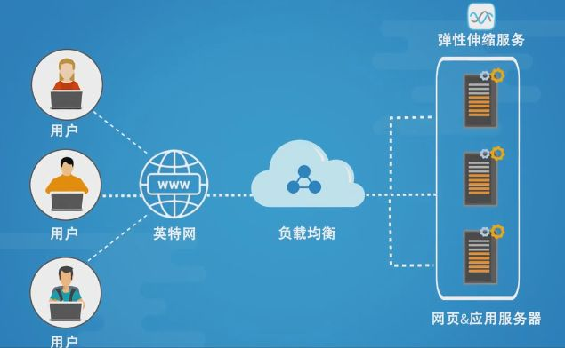
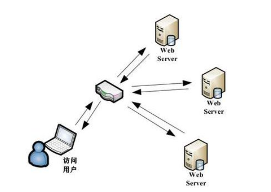

# 负载均衡笔记（siwang.hu&nbsp;&nbsp;V1.0）  
> + 在用户流量较小的场景下，我们通过设计一个单服务器就可以满足业务的负载需求  
>  
> + 面对流量非常大、系统功能复杂的场景时，单台服务器就算将性能优化得再好，也不能支撑这么大用户量的访问压力，这个时候就需要使用多台机器，设计高性能的集群来应对  
>  
> + 面对集群中服务器的负载分配，就需要引入负载均衡策略  
>  
> + 负载均衡（Load balancing）是指把用户访问的流量，通过负载均衡器，根据某种转发的策略，均匀的分发到后端多台服务器上，后端的服务器可以独立的响应和处理请求，从而实现分散负载的效果  
>  
>   
>  
## 负载均衡方案  
> + 基于DNS负载均衡  
>  
> + 基于硬件负载均衡  
>  
> + 基于软件负载均衡
>  
### 基于DNS负载均衡  
> **原理与优点**  
> + 利用用户访问域名的时候，会先向DNS服务器去解析域名对应的IP地址，这个时候我们可以让DNS服务器根据不同地理位置的用户返回不同的IP,减轻了单个集群的负载压力，也提升了用户的访问速度，实现非常的简单  
>  
> **缺点**  
> + 当DNS配置修改后，生效不及时,这个是由于DNS自身的特性导致（DNS缓存）  
### 基于硬件负载均衡  
>   
>  
> **原理与优点**  
> + 硬件的负载均衡，它类似于是一个网络设备（与网络交换机相似）完全通过硬件来抗压力，性能是非常的好，每秒能处理的请求数达到百万级，即 几百万/秒 的负载  
>  
> **缺点**  
> + 硬件负载均衡器往往价格非常的贵  
### 基于软件负载均衡  
> + 软件负载均衡是指使用软件的方式来分发和均衡流量，网络分为7层协议，软件实现负载均衡一般可以在传输层或应用层来做流量分发，实现负载均衡，传输层上实现负载均衡效率好一点  
>  
> + 传输层------LVS(Linux虚拟服务器)，linux上的负载均衡策略  
>  
> + 应用层------Nginx，采用Nginx的负载均衡策略  
## 负载均衡算法  
> + 轮询策略  
> 将请求轮流的转发到后端不同的业务服务器上，无需关注后端服务的状态，有请求时，就往后端轮流转发，简单、实用  
>  
> + 负载度策略  
> 先评估后端每台服务器的负载压力情况，对于压力比较大的后端服务器转发的请求少一些，对于压力比较小的后端服务器多转发一些请求给它 **（负载度评判标准：连接数、请求数、CPU负载指标、IO负载指标）**  
>  
> + 响应策略  
> 当请求过来的时候，会优先将请求转发给当前时刻响应最快的后端服务器，用户体验更好 **（这种算法需要负载均衡器去不停的统计后台每台服务器的响应速度，增加负载均衡器的负担）**  
>  
> + 哈希策略  
> 对请求中的某个信息进行hash计算，根据后端服务器台数取模，得到一个值，算出相同值的请求就被转发到同一台后端服务器中 **（可以保证相同的源请求被分配到固定的后台服务器上，方便处理回话,缓存）**  
>  
## 负载均衡后的Session问题  
> ### **Session**  
> 浏览器获取Web服务器的服务，往往需要多次交互，http协议本身是无状态的，为了让服务器知道每个请求是来自那一个回话（session）,需要浏览器在请求服务器时带上sessionId，来区分这次请求属于那次回话。这个sessionId往往是第一次请求是服务器返回给浏览器存在cookie中的，如果浏览器禁用了cookie，就需要在每次请求是把sessionId放在URL参数中  
>  
> **问题**  
> 在使用了负载均衡策略后，我们的应用服务器有许多的台，如果不采取适当的措施，每次请求将落在不同的服务器上，服务器集群将会保存多份sessionId,明明是同一个浏览器发出的请求，后台集群确为此保存了多份sessionId,这将会对后面的业务处理造成很大的困扰  
>  
## Session问题解决方法  
> + Session保持  
>  
> + Session复制  
>  
> + Session共享  
### Session保持  
> Session保持（Session Sticky），通过会话保持，负载均衡进行请求分发的时候保证每个客户端固定的访问到后端的同一台应用服务器。会话保持方案在所有的负载均衡都有对应的实现。而且这是**在负载均衡这一层就可以解决Session问题**  
> + 按访问ip的hash结果分配服务器  
> + 第一次访问插入一个Cookie，下一次访问的时候浏览器带上这个Cookie,按照这个Cookie分配固定的后台服务器  
>  
> **缺点**  
> 如果后端有服务器宕机，那么这台服务器的Session丢失，被分配到这台服务请求的用户还是需要重新登录，同时也无法保证负载的绝对均衡  
### Session复制  
> Session复制（Session Replication），集群中所有服务器上都要保持用户的Session，每个应用服务器中的Session信息复制到其它服务器节点上  
>  
> **缺点**  
> 同步集群中的Session将浪费大量的网络带宽开销，每台服务器需要保存所有集权中的Sesssion，浪费存储空间  
### Session共享  
> Session共享（Session集中存储），集群中的所有服务器都在一个地方进行Session的存取，当服务器数量大，Session数多时，集中存储优势非常的明显